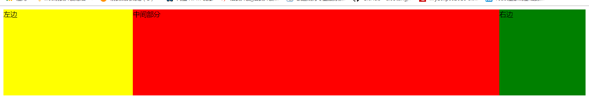

# 一.实现三栏布局



## 1.圣杯布局

最外层用 padding 撑开，左右两边留有预设宽度，浮动，调整里面左右元素的相对定位值和 margin 值实现左右元素正好在预留宽度中

### html

```html
<div class="container">
  <div class="main">中间部分</div>
  <div class="left">左边</div>
  <div class="right">右边</div>
</div>
```

### css

```css
.container {
  padding: 0 200px 0 300px;
}

.main,
.left,
.right {
  min-height: 200px;
  float: left;
  position: relative;
}

.main {
  background: red;
  width: 100%;
}

.left {
  background: yellow;
  width: 300px;
  margin-left: -100%;
  left: -300px;
}

.right {
  background: green;
  width: 200px;
  right: -200px;
  margin-left: -200px;
}
```

最外层用 padding 撑开，左右两边留有预设宽度，浮动，调整里面左右元素的相对定位值和 margin 值实现左右元素正好在预留宽度中

[查看页面](https://zhoubichuan.github.io/Note-Frontend/2.stand/2.W3C/2.css/3.布局/实现三栏布局/圣杯布局.html)

## 2.双飞翼布局

里面的中间层用 padding 撑开，预留的左右位置，由左右元素通过 margin 调节

### html

```html
<div class="main">
  <div class="container">中间</div>
</div>
<div class="left">左边</div>
<div class="right">右边</div>
```

### css

```css
.main,
.left,
.right {
  height: 150px;
  float: left;
}

.main {
  width: 100%;
}

.container {
  background: red;
  padding: 0 200px 0 300px;
  height: 100%;
}

.left {
  background: yellow;
  width: 300px;
  margin-left: -100%;
}

.right {
  background: green;
  width: 200px;
  margin-left: -200px;
}

body::after {
  content: "";
}
```

[查看页面](https://zhoubichuan.github.io/Note-Frontend/2.stand/2.W3C/2.css/3.布局/实现三栏布局/双飞翼布局.html)

## 3.弹性盒子布局

低版本浏览器不支持

### html

```html
<div class="container">
  <div class="left">左边</div>
  <div class="main">中间</div>
  <div class="right">右边</div>
</div>
```

### css

```css
.container {
  display: flex;
  height: 200px;
}

.left {
  background: red;
  flex: 0 0 300px;
}

.main {
  background: yellow;
  width: 100%;
}

.right {
  background: green;
  flex: 0 0 200px;
}
```

[查看页面](https://zhoubichuan.github.io/Note-Frontend/2.stand/2.W3C/2.css/3.布局/实现三栏布局/弹性盒子.html)

## 4.calc 属性

中间的长度=100%宽度减去左右长度之和

### html

```html
<div class="container">
  <div class="left">左边</div>
  <div class="main">中间</div>
  <div class="right">右边</div>
</div>
```

### css

```css
width: calc(100% - 500px);
```

[查看页面](https://zhoubichuan.github.io/Note-Frontend/2.stand/2.W3C/2.css/3.布局/实现三栏布局/calc属性.html)

## 5.box-sizing 属性

将中间元素里面的元素变成怪异盒模型，这样就留出了左右位置，左右元素通过 margin 就占据左右位置

### html

```html
<div class="main">
  <div class="container">中间</div>
</div>
<div class="left">左边</div>
<div class="right">右边</div>
```

### css

```css
.main {
  width: 100%;
  padding: 0 200px 0 300px;
  box-sizing: border-box;
}
```

[查看页面](https://zhoubichuan.github.io/Note-Frontend/2.stand/2.W3C/2.css/3.布局/实现三栏布局/box-sizing.html)

## 6.绝对定位

中间用 padding 撑开或者 calc 计算出，两边用定位占据左右位置

### html

```html
<div class="container">
  <div class="main">中间部分</div>
  <div class="left">左边</div>
  <div class="right">右边</div>
</div>
```

### css

```css
.main {
  background: yellow;
  padding: 0 200px 0 300px;
}

.left {
  position: absolute;
  left: 0;
  width: 300px;
  background: red;
  top: 0;
}

.right {
  position: absolute;
  right: 0;
  width: 200px;
  background: gray;
  top: 0;
}
```

[查看页面](https://zhoubichuan.github.io/Note-Frontend/2.stand/2.W3C/2.css/3.布局/实现三栏布局/绝对定位.html)
