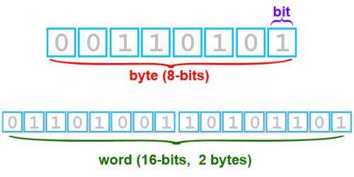

# 四.编码

## 1.URL 编码

## 2.语言代码

## 3.字符集


## 1.字符发展历史

### 1.1 字节

- 计算机内部，所有信息最终都是一个二进制值
- 每一个二进制位（bit）有 0 和 1 两种状态，因此八个二进制位就可以组合出 256 种状态，这被称为一个字节（byte）



### 1.2 单位

- 8 位 = 1 字节
- 1024 字节 = 1K
- 1024K = 1M
- 1O24M = 1G
- 1024G = 1T

### 1.3 JavaScript 中的进制

#### 1.3.1 进制表示

```js
let a = 0b10100 // 二进制
let b = 0o24 // 八进制
let c = 20 // 十进制
let d = 0x14 // 十六进制
console.log(a == b)
console.log(b == c)
console.log(c == d)
```

#### 1.3.2 进制转换

- 10 进制转任意制度

```js
let a = 20
console.log(a.toString(2))
```

- 任意进制转十进制 parseInt('任意进制字符串',原始进制)

```js
let a = 10100
console.log(parseInt(a, 2))
```

### 1.4 ASCII

最开始计算机只在美国用，八位的字节可以组合出 256 种不同状态。0-32 种状态规定了特殊用途，一旦终端、打印机遇上约定好的这些字节被传过来时，就要做一些约定的动作，如：

- 遇上 0x10，终端就换行
- 遇上 0x07，终端就向人们嘟嘟叫

又把所有的空格、标点符号、数字、大小写字母分别用连续的字节状态表示，一直编到了第 127 号，这样计算机就可以用不同字节来存储英文的文字了

这 128 个符号（包括 32 个不能打印出来的控制符号），只占用了一个字节的后面 7 位，最前面的一位统一规定为 0


这个方案叫做 ASCII 编码
::: tip 提示
American Standard Code for Information Interchange：美国信息互换标准代码
:::

### 1.5 GB2312

后来西欧一些国家用的不是英文，它们的字母在 ASCII 里没有为了可以保存他们的文字，他们使用 127 号这后的空位来保存新的字母，一直编到了最后一位 255。比如法语中的 é 的编码为 130。当然了不同国家表示的符号也不一样，比如，130 在法语编码中代表了 é，在希伯来语编码中却代表了字母 Gimel (ג)。
::: tip 提示
从 128 到 255 这一页的字符集被称为扩展字符集。
:::
中国为了表示汉字，把 127 号之后符号取消了，规定

- 一个小于 127 的字符的意义与原来相同，但两个大于 127 的字符连在一起时，就表示一个汉字
- 前面一个字节（他称之为高字节）从`0xA1`用到`0xF7`，后面一个字节（低字节）从`0xA1`到`0xFE`
- 这样我们就可以组合出大约 7000 多个（247-161）\* (254-161)=7998 简体汉字了
- 还把数学符号、日文假名和 ASCII 里原来就有的数字、标点和字母都重新编成两个字长的编码。这就是全角字符，127 以下哪些就叫半角字符。
- 把这种汉字方案叫做 GB2312。GB2312 是对 ASCII 的中文扩展

### 1.6 GBK

后来还是不够用，于是干脆不再要求低字节一定是 127 号之后的内码，只要第一个字节是大于 127 就固定表示这是一个汉字的开始，又增加了近 20000 个新的汉字（包括繁体字）和符号。

### 1.7 GB18030 / DBCS

又加了几千个新的少数民族的字，`GBK`扩成了`GB18030`通称他们叫做 DBCS
::: tips 注意
Double Byte Character Set：双字节字符集。
:::
在 DBCS 系列标准里，最大的特点是两字节长的汉字字符和一字节长的英文字符并存于同一套编码方案里

各个国家都像中国这样搞出一套自己的编码标准，结果互相之间谁也不懂谁的编码，谁也不支持别人的编码

### 1.8 Unicode

ISO 的国际组织废了所有的地区性的编码方案，重新搞了一个包含了地球上所有文化、所有字母和符号的编码!Unicode 保持其原编码不变，只是将其长度由原来的 8 位扩展为 16 位，而其他文化和语言的字符则全部重新统一编码。

从 Unicode 开始，无论是半角的英文字母，还是全角的汉字，它们都是统一的一个字符！同时，也都是统一的两个字节

- 字节是一个 8 位的物理存储单元
- 而字符则是一个文化相关的符号

### UTF-8

Unicode 在很长一段时间内无法推广，直到互联网的出现，为解决 Unicode 如何在网络上传输的问题，于是面向传输的众多 UTF 标准出现了
::: tips 注意
Universal Character Set（UCS）Transfer Format：UTF 编码
:::

- UTF-8 就是在互联网上使用最广的一种 Unicode 的实现方式
- UTF-8 就是每次以 8 个为单位传输数据
- 而 UTF-16 就是每次 16 个位
- UTF-8 最大的一个特点，就是它是一种变长的编码方式
- Unicode 一个中文字符占 2 个字节，而 UTF-8 一个中文字符占 3 个字节
- UTF-8 是 Unicode 的实现方式之一

## 1.10 编码规则

1.对于单字节的符号，字节的第一位设为 0，后面 7 位为这个符号的 Unicode 码。因此对于英文字母，UTF-8 编码和 ASCII 码是相同的

2.对于 n 字节的符号(n>1),第一个字节的前 n 位都设为 1，第 n+1 位设为 0，后面字节的前两位一律设为 10

Unicode 符号范围 | UTF-8 编码方式
(十六进制) | （二进制）
--- | ---
0000 0000-0000 007F | 0xxxxxxx
0000 0080-0000 07FF | 110xxxxx 10xxxxxx
0000 0800-0000 FFFF | 1110xxxx 10xxxxxx 10xxxxxx
0001 0000-0010 FFFF | 11110xxx 10xxxxxx 10xxxxxx 10xxxxxx
