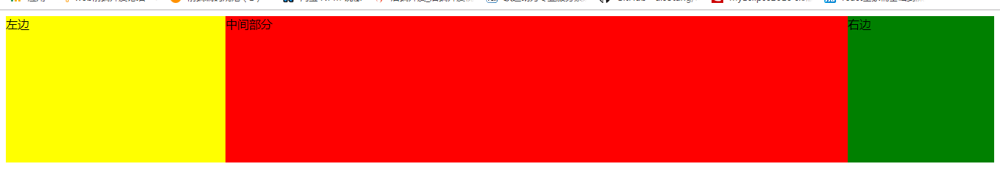
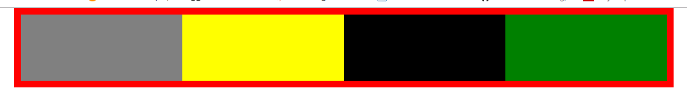

# 一.语法

## 1.@规则

## 2.层叠

## 3.注释

## 4.解释器

## 5.继承

## 6.简写

## 7.优先级

## 8.值定义

## 9.单位与取值类型

## 10.清除浮动

- 浮动：父级出现塌陷

  

- 清除浮动：

  

### 1.table

### html

```html
<ul>
  <li></li>
  <li></li>
  <li></li>
  <li></li>
</ul>
```

### css

```css
ul {
  display: table;
}
```

[查看代码](`./table.html`)

### 1.table

### html

```html
<ul>
  <li></li>
  <li></li>
  <li></li>
  <li></li>
</ul>
```

### css

```css
ul {
  display: table;
}
```

[查看代码](`./table.html`)

### 2.inline-block

### html

```html
<ul>
  <li></li>
  <li></li>
  <li></li>
  <li></li>
</ul>
```

### css

```css
ul {
  display: inline-block;
}
```

[查看代码](`./inline-block.html`)

### 3.父级浮动

### html

```html
<ul>
  <li></li>
  <li></li>
  <li></li>
  <li></li>
</ul>
```

### css

```css
ul {
  float: left;
}
```

[查看代码](`./父级浮动.html`)

### 4.overflow:hidden/auto

### html

```html
<ul>
  <li></li>
  <li></li>
  <li></li>
  <li></li>
</ul>
```

### css

```css
ul {
  overflow: hidden;
}
```

或者

```css
ul {
  overflow: auto;
}
```

[查看代码](`./overflow.html`)

### 5.clear:both

### html

```html
<ul>
  <li></li>
  <li></li>
  <li></li>
  <li></li>
</ul>
```

### css

```css
ul::after {
  content: "";
  clear: both;
  display: block;
}
```

[查看代码](`./clear.html`)
