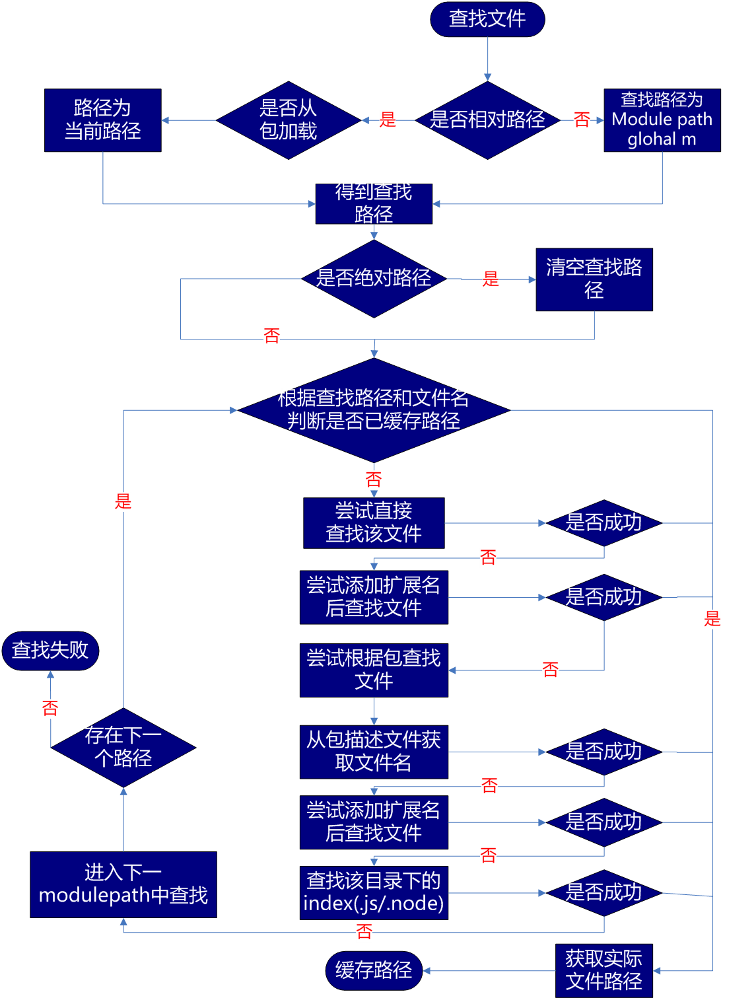

# 八.模块化

## 1.js 模块化的不足

- JS 没有模块系统，不支持封闭的作用域和依赖管理
- 没有标准库，没有文件系统和 io 流 api
- 没有包管理系统

## 2.CommonJS 规范

- 封装功能
- 封装作用域
- 可能解决依赖问题
- 工作效率更高，重构方便

## 3.Node 中的 CommonJS

- 在 node.js 里，模块划分所有的功能，每个 JS 都是一个模块
- 实现 require 方法，npm 实现了模块的自动加载和安装依赖

```js
;(function(exports, require, module, __filename, __dirname) {
  exports = module.exports = {}
  exports.name = "zfpx"
  exports = { name: "zfpx" }
  return module.exports
})
```

## 4.模块分类

### 4.1 原生模块

`http`、`path`、`fs`、`util`、`events`编译成二进制，加载速度最快，原来模块通过名称加载

### 4.2 文件模块

在硬盘的某个位置，加载速度非常慢，文件模块通过名称或路径来加载文件模块的后缀有三种

- 后缀名为.js 的 JavaScript 脚本文件，需要先读入内存再运行
- 后缀名为.json 的 JSON 文件，fs 读入内存转化为 JSON 对象
- 后缀名为.node 的经过编译后的二进制 C/C++扩展模块文件，可以直接使用
  ::: tip 提示
  一般自己写的通过路径来加载，别人写的通过名称去当前目录或全局 node_modules 下面去找
  :::

### 4.3 第三方模块

- 如果 require 函数只指定名称则视为 node_modules 下面加载文件，这样的话可以移动模块而不需要修改引用的模块路径
- 第三方模块查询包括 module.paths 和全局目录

#### 4.3.1 . 全局目录

window 如果在环境变量中设置了 NODE_PATH 变量，并将变量设置为一个有效的磁盘目录，require 在本地找不到此模块时向在此目录下找这个模块。 UNIX 操作系统中会从 $HOME/.node_modules $HOME/.node_libraries 目录下寻找

### 4.4 模块的加载策略


### 4.5 文件模块查找规则



## 5.外部访问内部

- 使用 exports 对象
- 使用 module.exports 导出引用类型

## 6.模块对象属性

- module.id
- module.filename
- module.loaded
- module.parent
- module.children
- module.paths

## 7.包

在 Node.js 中，可以通过包来对一组具有相互依赖关系的模块进行统一管理，通过包可以把某个独立功能封装起来，每个项目的根目录下面，一般都有一个 package.json 文件，定义了这个项目所需要的各种模块，以及项目的配置信息（比如名称、版本、许可证等元数据）。npm install 命令根据这个配置文件，自动下载所需的模块，也就是项目所需的运行和开发环境。

| 项目                | 描述                             |
| ------------------- | -------------------------------- |
| name                | 项目名称                         |
| version             | 版本号                           |
| description         | 项目描述                         |
| keywords: {Array}   | 关键词，便于用户搜索到我们的项目 |
| homepage            | 项目 url 主页                    |
| bugs                | 项目问题反馈的 Url 或 email 配置 |
| license             | 项目许可证                       |
| author,contributors | 作者和贡献者                     |
| main                | 主文件                           |
| bin                 | 项目用到的可执行文件配置         |
| repository          | 项目代码存放地方                 |
| scripts             | 声明一系列 npm 脚本指令          |
| dependencies        | 项目在生产环境中依赖的包         |
| devDependencies     | 项目在生产环境中依赖的包         |
| peerDependencies    | 应用运行依赖的宿主包             |

package.json
## 8.npm
- 安装完node之后只能使用node语言特性及核心函数，我们还需要一个系统下载、安装和管理第三方模块
- 在node里这个系统被称为node包管理器（Node Package Manager,NPM）
### 8.1 npm提供给的功能
- 公共注册服务，用户可以把自己写的包上传到服务器上
- 命令行下载工具，用户可以通过npm命令吧别人写的包下载到自己电脑上，还可以管理自己模块依赖的其他模块

搜索第三方包的地址
```
https://www.npmjs.com/search
```
## 9.yarn


模块化的开发方式可以提高代码复用率，方便进行代码的管理。通常一个文件就是一个模块，有自己的作用域，只向外暴露特定的变量和函数。目前流行的 js 模块化规范有 CommonJS、AMD、CMD 以及 ES6 的模块系统。

### 一、CommonJS

Node.js 是 commonJS 规范的主要实践者，它有四个重要的环境变量为模块化的实现提供支持：`module`、`exports`、`require`、`global`。实际使用时，用`module.exports`定义当前模块对外输出的接口（不推荐直接用`exports`）,用`require`加载模块。

```js
//定义模块math.js
var basicNum=0
function add(a,b){
	return a+b
}
//写上需要向外暴露的函数，变量
module.exports={
	add:add,
	basicNum:basicNum
}
//引用自定义的模块是，参数包含路径，可省略.js
var math=require('./math')
math.add(2,5)
//引用核心模块时，不需要带路径
var http=require('http')
http.createService(...).listen(3000)
```

commonJS 用同步的方式加载模块。在服务端，模块文件都存在本地磁盘，读取非常快，所以这样做不会有问题。但是在浏览器端，限制于网络原因，更合理的方案是使用异步加载。

### 二、AMD 和 require.js

AMD 规范采用异步方式加载模块，模块的加载不影响它后面语句的运行。所有依赖这个模块的语句，都定义在一个回调函数中，等加载完成之后，这个回调函数才会运行。这里介绍用 require.js 实现 AMD 规范的模块化：用`require.config()`指定引用路径等，用`define()`定义模块，用`require()`加载模块。

首先我们需要引入 require.js 文件和一个入口文件 main.js。main.js 中配置`require.config()`并规定项目中用到的基础模块。

```
//网页中引入require.js及main.js
<script src="js/require.js" data-main='ja/main'></script>
//main.js入口文件/主模块
//首先用config()指定各模块路径和引用名
require.config({
	baseUrl:'js/lib',
	path:{
		'jquery':'jquery.min',
		'underscore':'underscroe.min'
	}
})
//执行基本操作
require(['jquery','underscore'],function($,_){
	//some code here
})
```

引用模块的时候，我们将模块名放在`[]`中作为`require()`的第一参数；如果我们定义的模块本身也依赖其他模块，那就需要将它们放在`[]`中作为`define()`的第一参数

```
//定义math.js模块
define(function(){
	var basicNum=0
	var add=function(x,y){
		return x+y
	}
	return {
		add:add,
		basicNum:basicNum
	}
})
//定义一个依赖underscore.js的模块
define(['underscore'],function(_){
	var classfy=function(list){
		_.countBy(list,function(num){
			return num > 30?'old':'young'
		})
	}
	return {
		classify:classify
	}
})
//引用模块，将模块放在[]内
require(['jquery','math'],function($,math){
	var sum=math.add(10,20)
	$("#sum").html(sum)
})
```

### 三、CMD 和 sea.js

require.js 在申明依赖的模块时会在第一之间加载并执行模块内的代码：

```
define(['a','b','c','d','e','f'],function(a,b,c,d,e,f){
	//等于在最前面声明并初始化了要用到的所有模块
	if(false){
		b.foo()
	}
})
```

CMD 是另一种 js 模块化方案，它与 AMD 很类似，不同点在于：AMD 推崇依赖前置，提前执行；CMD 推崇依赖就近，延迟执行。此规范在 sea.js 推广过程中产生的。

### 四、ES6 Module

ES6 在语言标准的层面上，实现了模块功能，而且实现的相当简单，旨在称为浏览器和服务器通用的解决方案。其模块功能主要由两个命令构成：`export`和`import`.`export`命令用于规定模块的对外接口，`import`命令用于输入其他模块提供的功能。

```
//定义模块
var basicNum=0
var add=function (a,b){
	return a+b
}
export{basicNum,add}

//引用模块
import {basicNum,add} from './math'
function test(ele){
	ele.textContent=add(99+basicNum)
}
```

如上例所示，使用`import`命令的时候，用户需要知道所要加载的变量名或函数名。其实 ES6 还提供了`export default`命令，为模块指定默认输出，对应的`import`语句不需要使用大括号.

```
//定义输出
export default {basicNum,add}
//引入
import math from './math'
function test(ele){
	ele.textContent=math.add(99+math.basicNum)
}
```

ES6 的模块不是对象，`import`命令会被 JavaScript 引擎静态分析，在编译时就引入模块代码，而不是扎起代码运行时加载，所以无法实现条件加载。也正因为这个，使得静态分析成为可能。

### 五、ES6 模块与 CommonJS 模块的差异

#### 1.CommonJS 模块输出的是一个值的拷贝，ES6 模块输出的是值的引用。

- CommonJS 模块输出的是值的拷贝，也就是说，一旦输出一个值，模块内部的变化就影响不到这个值。
- ES6 模块的运行机制与 CommonJS 不一样。JS 引擎对脚本静态分析的时候，遇到模块加载命令`import`就会生成一个只读引用。等到脚本真正执行时，再根据这个只读引用，到被加载的吧、那个模块里面去取值。

#### 2.CommonJS 模块是运行时加载，ES6 模块是编译时输出接口。

- 运行时加载 CommonJS 模块就是对象，即在输入时是先加载整个模块，生成

一个对象在从这个对象上面读取方法，这种加载称为‘运行时加载’

- 编译时加载：ES6 模块不是对象，而是通过`export`命令显式指定输出的代码，`import`静态命令的形式。即在`import`时可以指定加载某个输出值，而不是加载整个模块，这个称为“编译时加载”

  CommonJS 加载的是一个对象，该对象只有在脚本运行完才会生成。而 ES6 模块不是对象，它的对外接口只是一种静态定义，在代码静态解析阶段就会生成
