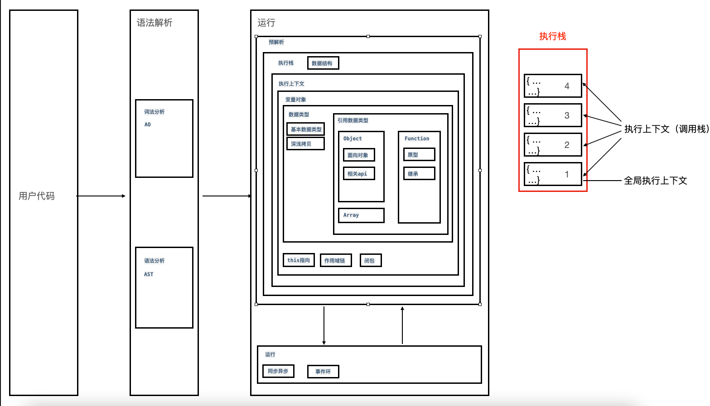

# 运行机制

::: tip 前言
javascript 代码不能直接在浏览器里面运行，必须通过 v8 引擎转换成可以在浏览器里运行的代码，大致分为编译阶段和运行阶段两个过程
:::

## 1.编译阶段

转化过程可以分为：

- 词法分析（parse）：字符串转化为代码块
- 语法分析（ast）：代码块转化为抽象语法树
- 代码生成（gencode）：化为可执行的代码

## 2.运行阶段

- 代码运行环境：执行栈中创建执行上下文
- 执行上下文生命周期：（闭包、同步异步、事件环）

  - 创建阶段
    - 创建变量对象(VO)
    - 确定作用域链(scopes 确定变量的访问规则)
    - 确定`this`指向
  - 执行阶段
    - 变量赋值
    - 函数赋值
    - 代码执行

  
