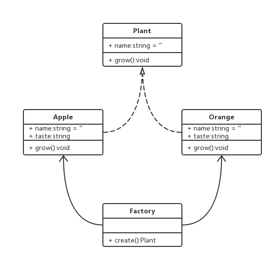
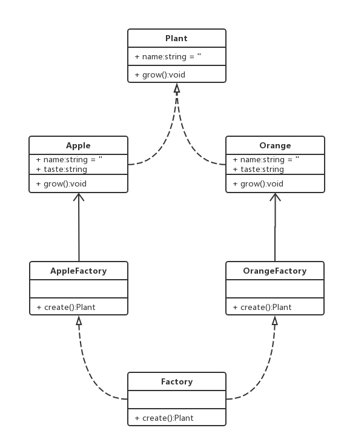

# 一.工厂模式
::: tip 前言
简单⼯⼚模式⼜叫 **静态⽅法模式**，因为⼯⼚类中定义了⼀个静态⽅法⽤于创建对象。简单⼯⼚让使⽤者
不⽤知道具体的参数就可以创建出所需的 ”产品“ 类，即使⽤者可以直接消费产品⽽不需要知道产品的具
体⽣产细节
:::
## 1.简单工厂模式

- 简单工厂模式是由一个工厂对象决定创建出哪一种产品类的实例

### 1.1 类图



### 1.2 代码

```ts
//简单的工厂模式案例
class Plant {
  name: string
  constructor(name: string) {
    this.name = name
  }
  growing(): void {
    console.log("生长")
  }
}
class Apple extends Plant {
  taste: string
  constructor(name: string, taste: string) {
    super(name)
    this.taste = taste
  }
}
class Orange extends Plant {
  taste: string
  constructor(name: string, taste: string) {
    super(name)
    this.taste = taste
  }
}
class Factory {
  static create(name: string): any {
    switch (name) {
      case "apple":
        return new Apple("苹果", "甜的")
      case "orange":
        return new Orange("橘子", "酸的")
    }
  }
}
let apple1 = Factory.create("apple")
console.log(apple1)
let orange1 = Factory.create("orange")
console.log(orange1)
```

[TS 在线编译](https://www.typescriptlang.org/zh/play)

### 1.3 场景

#### jQuery：每次调用 jq 自己都会在内部 new 一个新的实例
```ts
$("p").html("Hello <b>world</b>!")
```
实现原理：
```ts
class jQuery {
  length: number
  constructor(selector: string) {
    let elements = (<any>Array).from(document.querySelectorAll(selector))
    let length = elements ? elements.length : 0
    for (let i = 0; i < length; i++) {
      this[i] = elements[i]
    }
    this.length = length
  }
  html() {}
}
let $ = function(selector: string) {
  return new jQuery(selector)
}
```

- React

```ts
class Vnode {
  tag: string
  attrs: string
  children: string
  constructor(tag: string, attrs: string, children: string) {
    this.tag = tag
    this.attrs = attrs
    this.children = children
  }
}
let React: any = { createElement: "" }
React.createElement = function(
  tag: string,
  attrs: string,
  children: string
): object {
  return new Vnode(tag, attrs, children)
}
```

## 2.工厂方法模式

- 工厂方法模式`Factory Method`,又称多态性工厂模式
- 在工厂方法模式中，核心的工厂类不再负责所有的产品的创建，而是将具体创建的工作交给子类去做

### 2.1 类图



### 2.2 代码

```ts
class Plant {
  name: string
  constructor(name: string) {
    this.name = name
  }
  grow() {
    console.log("grow~~~")
  }
}
class Apple extends Plant {
  taste: string
  constructor(name: string) {
    super(name)
    this.taste = "甜"
  }
}
class Orange extends Plant {
  taste: string
  constructor(name: string) {
    super(name)
    this.taste = "酸"
  }
}
class AppleFactory {
  create() {
    return new Apple("苹果")
  }
}
class OrangeFactory {
  create() {
    return new Orange("橘子")
  }
}
const settings = {
  apple: AppleFactory,
  orange: OrangeFactory,
}
let apple = new settings["apple"]().create()
console.log(Apple)
let orange = new settings["orange"]().create()
console.log(Orange)
```

### 2.3 场景

- d3.js
- three.js
- openlayers
