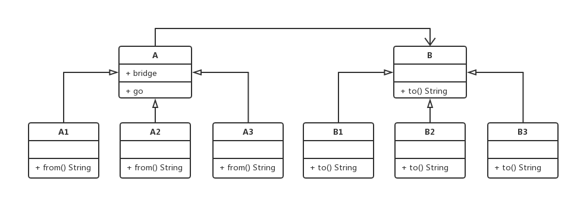

# 十.桥接模式

- 将抽象部分与他的实现部分分离，这样抽象化与实现化解耦，使他们可以独立的变化
- 应用场景是实现系统可能有多个角度分类，每一种角度都可能变化
- 桥方可以通过实现桥接口进行单方面扩展，而另一方可以继承抽象类而单方面扩展，而之间的调用就从桥接口来作为突破口，不会受到双方扩展的任何影响

## 1.类图



## 2.代码

```js
class A {
  constructor(bridge) {
    this.position = "A地点"
    this.bridge = bridge
  }
  go() {
    console.log(`从${this.from()}到达${this.bridge.to}`)
  }
  from() {
    throw new Error("子类必须实现此方法")
  }
}
class A1 extends A {
  from() {
    return "A1"
  }
}
class A2 extends A {
  from() {
    return "A2"
  }
}
class B {
  to() {
    throw new Error("子类必须实现此方法")
  }
}
class B1 extends B {
  to() {
    return "B1"
  }
}
class B2 extends B {
  to() {
    return "B2"
  }
}
let b1 = new B2()
let b2 = new B()
```

package.json

```js
{
  "dependencies": {
    "express": "^4.16.4"
  }
}
```

```js
let express = require("express")
let app = express()
let path = require("path")

app.get("/", (req, res) => {
  console.log(__dirname)
  res.sendFile(path.join(__dirname, "2.html"))
})
app.get("/user/:id", (req, res) => {
  let id = req.params.id
  res.json({
    id,
    name: id,
  })
})
app.listen(8080, () => {
  console.log(8080)
})
```

```html
<!DOCTYPE html>
<html lang="en">
  <head>
    <meta charset="UTF-8" />
    <meta name="viewport" content="width=device-width, initial-scale=1.0" />
    <meta http-equiv="X-UA-Compatible" content="ie=edge" />
    <title>Document</title>
    <style>
      * {
        padding: 0;
        margin: 0;
      }

      canvas {
        border: 1px solid #ccc;
      }
    </style>
  </head>

  <body>
    <canvas id="canvas" width="1000" height="600"></canvas>
    <script>
      function Position(x, y) {
        this.x = x
        this.y = y
      }
      function CircleColor(color) {
        this.color = color
      }

      function Circle(x, y) {
        this.position = new Position(x, y)
        this.CircleColor = new CircleColor(CircleColor)
      }
      Circle.prototype.render = function () {
        let canvas = document.getElementById("canvas")
        let ctx = canvas.getContext("2d")
        ctx.beginPath()
        ctx.arc(this.position.x, this.position.y, 100, 0, 2 * Math.PI)
        ctx.fillStyle = this.CircleColor.color
        ctx.fill()
      }
      let c = new Circle(200, 200, 200, "red")

      c.render()
    </script>
  </body>
</html>
```

```html
<!DOCTYPE html>
<html lang="en">
  <head>
    <meta charset="UTF-8" />
    <meta name="viewport" content="width=device-width, initial-scale=1.0" />
    <meta http-equiv="X-UA-Compatible" content="ie=edge" />
    <title>Document</title>
  </head>

  <body>
    <ul>
      <li data-id="1">用户1</li>
      <li data-id="2">用户2</li>
    </ul>
    <p id="content"></p>
    <script>
      let lis = document.querySelectorAll("li")
      for (let i = 0; i < lis.length; i++) {
        lis[i].addEventListener("click", getUserById)
      }
      function getUserById(event) {
        let id = event.target.dataset.id
        let xhr = new XMLHttpRequest()
        xhr.open("GET", `/user/${id}`, true)
        xhr.responseType = "json"
        xhr.onreadystatechange = function () {
          let user = xhr.response
          if (xhr.readyState == 4 && xhr.status == 200) {
            document.getElementById("content").innerHTML = user.name
          }
        }
        xhr.send()
      }
    </script>
  </body>
</html>
```
