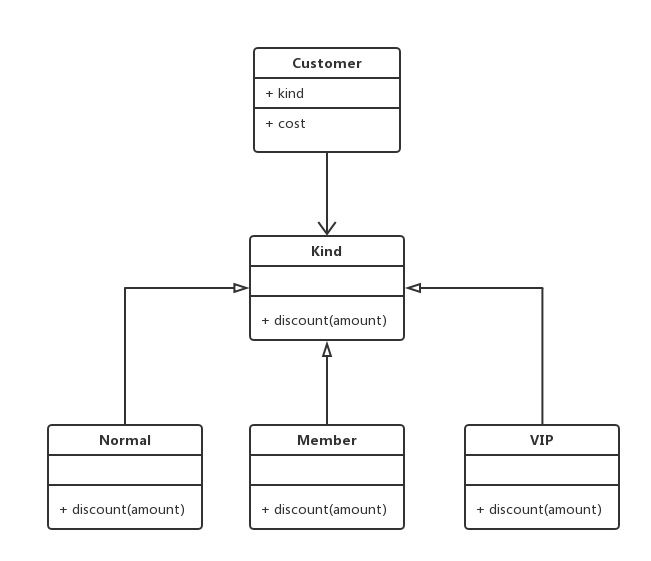

# 十三.策略模式

- 将定义的一组算法封装起来，使其相互之间可以替换。封装的算法具有一定的独立性，不会随客户端变化而变化。
- 避免大量的 if/else 或 switch/case

## 1.类图



## 2.代码

```ts
/* 如果不用策略模式代码都耦合在一起了 */
class Customer {
  public type: string;
  constructor(type) {
    this.type = type;
  }
  pay(amount) {
    if (this.type == "会员顾客") {
      return amount * 0.9;
    } else if (this.type == "VIP顾客") {
      return amount * 0.8;
    }
    return amount;
  }
}
let c1 = new Customer("普通顾客");
console.log(c1.pay(100));
let c2 = new Customer("会员顾客");
console.log(c2.pay(100));
let c3 = new Customer("VIP顾客");
console.log(c3.pay(100));

/* 1、用策略模式改写：可以解耦合 */
class Customer2 {
  public kind: any;
  constructor(kind) {
    this.kind = kind;
  }
  cost(amount) {
    return this.kind.discount(amount);
  }
}
class Kind {}
class Normal extends Kind {
  discount(amount) {
    return amount;
  }
}
class Member extends Kind {
  discount(amount) {
    return amount * 0.9;
  }
}
class VIP extends Kind {
  discount(amount) {
    return amount * 0.8;
  }
}
let d1 = new Customer2(new Normal());
console.log(d1.cost(100));
d1.kind = new Member();
console.log(d1.cost(100));
d1.kind = new VIP();
console.log(d1.cost(100));

/* 2、把算法封装在策略对象中，指定算法调用即可 */
class Customer3 {
  kinds: object;
  constructor() {
    this.kinds = {
      normal: function(price) {
        return price;
      },
      member: function(price) {
        return price * 0.9;
      },
      vip: function(price) {
        return price * 0.8;
      },
    };
  }
  cost(kind, amount) {
    return this.kinds[kind](amount);
  }
}
let c = new Customer3();
console.log(c.cost("normal", 100));
console.log(c.cost("member", 100));
console.log(c.cost("vip", 100));
```
