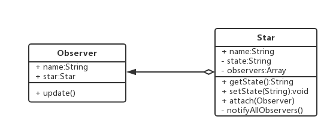

# 十五.观察者模式

- 被观察者供维护观察者的一系列方法
- 观察者提供更新接口
- 观察者把自己注册到被观察者里
- 在被观察者发生变化的时候，调用观察者的更新方法

## 1.类图



## 2.代码

```js
class Star {
  constructor(name) {
    this.name = name;
    this.state = "";
    this.observers = [];
  }
  getState() {
    return this.state;
  }
  setState(state) {
    this.state = state;
    this.notifyAllObservers();
  }
  attach(observer) {
    this.observers.push(observer);
  }
  notifyAllObservers() {
    this.observers.forEach((observer) => observer.update());
  }
}
class Fan {
  constructor(name, subject) {
    this.name = name;
    this.subject = subject;
    this.subject.attach(this);
  }
  update() {
    console.log(
      `${this.subject.name}有新的状态-${this.subject.getState()},${
        this.name
      }正在更新`
    );
  }
}
let star = new Star("赵丽颖");
let fan1 = new Fan("小明", star);
star.setState("结婚");
```

## 3.场景

事件绑定

Promise

callback

events

流

http 服务器

生命周期函数

vue-watch

redux

```js
class Star {
  constructor(name) {
    this.name = name;
    this.state = "";
    this.observers = [];
  }
  getState() {
    return this.state;
  }
  setState(state) {
    this.state = state;
    this.notifyAllObservers();
  }
  attach(observer) {
    this.observers.push(observer);
  }
  notifyAllObservers() {
    this.observers.forEach((observer) => observer.update());
  }
}
class Fan {
  constructor(name, subject) {
    this.name = name;
    this.subject = subject;
    this.subject.attach(this);
  }
  update() {
    console.log(
      `${this.subject.name}有新的状态-${this.subject.getState()}，${
        this.name
      }正在更新`
    );
  }
}
let star = new Star("赵丽颖");
let fan1 = new Fan("我", star);
star.setState("结婚");
```
