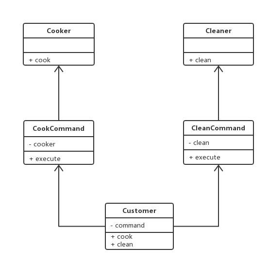

# 十八.命令模式

- 执行命令时，发布者和执行者分开
- 中间加入命令对象，作为中转站

三种角色

- `Receiver`接受者角色：该角色就是干活的角色，命令传递到这里是应该被执行的
- `Command`命令角色：需要执行的所有命令都在这里声明
- `Command`调用者角色：接收命令并执行命令

## 1.类图



## 2.代码

```js
class Cooker {
  cook() {
    console.log("做饭");
  }
}
class Cleaner {
  clean() {
    console.log("保洁");
  }
}
class CookCommand {
  constructor(receiver) {
    this.receiver = receiver;
  }
  execute() {
    this.receiver.cook();
  }
}
class CleanCommand {
  constructor(receiver) {
    this.receiver = receiver;
  }
  execute() {
    this.receiver.clean();
  }
}
class Customer {
  constructor(command) {
    this.command = command;
  }
  clean() {
    this.command.execute();
  }
  cook() {
    this.command.execute();
  }
}
let cooker = new Cooker();
let cleaner = new Cleaner();
let cookCommand = new CleanCommand(cleaner);
let cleanCommand = new CleanCommand(cleaner);
let customer = new Customer(CookCommand);
customer.cook();
customer.customer.clean();
```
