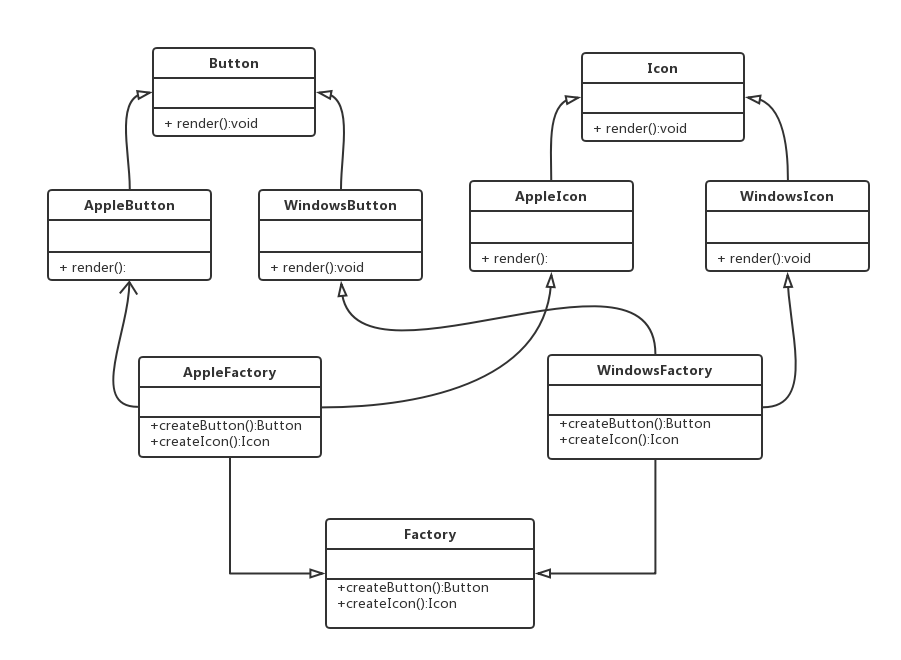

# 二.抽象工厂模式

- 抽象工厂模式是指当有多个抽象角色时，使用的一种工厂模式
- 抽象工厂模式可以向客户端提供一个接口，使客户端在不必指定产品的具体情况下，创建多个产品族中的产品对象

## 1.类图



## 2.代码

```ts
class Button {
  render(button) {
    console.log(button)
  }
}
class AppleButton extends Button {}
class WindowsButton extends Button {}
class Icon {
  render(icon) {
    console.log(icon)
  }
}
class AppleIcon extends Icon {}
class WindowsIcon extends Icon {}
class AppleFactory {
  createButton() {
    return new AppleButton("苹果按钮")
  }
  createIcon() {
    return new AppleIcon("苹果图标")
  }
}
class WindowsFactory {
  createButton() {
    return new WindowsButton("Windows按钮")
  }
  createIcon() {
    return new WindowsIcon("Windows图标")
  }
}
const settings = {
  apple: AppleFactory,
  windows: WindowsFactory,
}
let appleFactory = new settings["apple"]()
appleFactory.createButton().render()
appleFactory.createIcon().render()

let windowsFactory = new settings["windows"]()
windowsFactory.createButton().render()
windowsFactory.createIcon().render()
```
