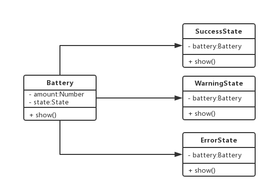

# 二十.状态模式

- 当一个对象的内部状态发生改变时，会导致其行为的改变，这看起来像是改变了对象
- 对象有自己的状态
- 不同的状态下执行的逻辑不一样
- 明确状态和每个状态下执行的动作
- 用来减少`if/else`语句

## 1.类图



## 2.代码

```js
class Battery {
  constructor() {
    this.amount = "high";
  }
  show() {
    if (this.amount == "high") {
      console.log("绿色");
      this.amount = "middle";
    } else if (this.amount == "middle") {
      console.log("黄色");
      this.amount = "low";
    } else {
      console.log("红色");
    }
  }
}
let battery = new Battery();
battery.show();
battery.show();
battery.show();
```

::: danger 缺点

- 违反开放-封闭原则
- 方法逻辑太多太复杂
- 颜色状态切换不明显
- 过多的 if/else 让代码不可维护

:::

改进

```js
class Battery {
  constructor(state) {
    this.amount = "high";
    this.state = new SuccessState();
  }
  show() {
    this.state.show();
    if (this.amount == "heigth") {
      this.amount = "middle";
      this.setState(new WarningState());
    } else if (this.amount == "middle") {
      this.amount = "low";
      this.setState(new DangerState());
    }
  }
  setState(state) {
    this.state = state;
  }
}
class SuccessState {
  constructor(battery) {
    this.battery = battery;
  }
  show() {
    console.log(`绿色${battery.amount}`);
  }
}
class WarningState {
  constructor(battery) {
    this.battery = battery;
  }
  show() {
    console.log(`黄色${battery.amount}`);
  }
}
class DangerState {
  constructor(battery) {
    this.battery = battery;
  }
  show() {
    console.log(`红色${battery.amount}`);
  }
}
let Battery = new Battery();
Battery.show();
Battery.show();
Battery.show();
```

## 3.场景

### 3.1 点赞

### 3.2 promise

### 3.3 React 导航

### 3.4 有限状态机
