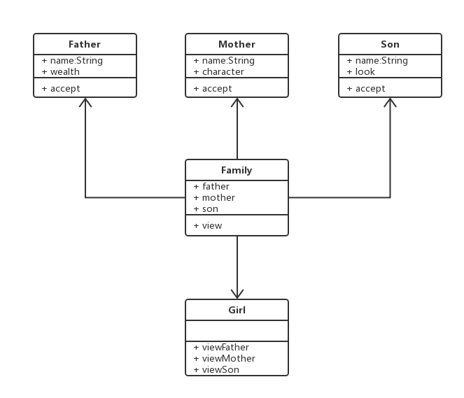

# 二十一.访问者模式

- 将数据操作和数据结构进行分离
- 有这么一个操作，它是作用于一些元素之上的，而这些元素属于某一个对象结构
- 同时这个操作是在不改变各元素类的前提下，在这个前提下定义新操作是访问者模式精髓中的精髓

## 1.组成部分

- `ObjectStructure`：定义当中所说的对象结构，对象结构是一个抽象表述，它内部管理了元素集合，并且可以迭代这些元素供访问者访问
- `Element`：元素接口或者抽象类，它定义了一个接受访问者的方法（Accept），其意义是没一个元素都要可以被访问者访问
- `ConcreteElementA、ConcreteElementB`：具体的元素类，它提供受访问方法的具体实现，而这个具体的实现，通常情况下是使用访问者提供的访问该元素类的方法
- `Visitor`：接口或抽象类，它定义了对每一个元素（Element）访问的行为，它的参数就是可以访问的元素，它的方法数理论上来讲与元素的个数是一样的，因此访问者要求元素的类族要稳定，如果经常添加、移除元素类，必然会导致频繁地修改 Visitor 接口，如果这样则不适合使用访问者模式

## 2.类图



## 3.代码

```js
class Father {
  constructor(name, wealth) {
    this.name = name;
    this.wealth = wealth;
  }
  accept(viewer) {
    viewer.viewFather(this);
  }
}
class Mother {
  constructor(name, character) {
    this.name = name;
    this.character = character;
  }
  accept(viewer) {
    viewer.viewMother(this);
  }
}
class Son {
  constructor(name, look) {
    this.name = name;
    this.look = look;
  }
  accept(viewer) {
    viewer.viewSon(this);
  }
}
class Family {
  constructor(father, mother, son) {
    this.father = father;
    this.mother = mother;
    this.son = son;
  }
  view(viewer) {
    this.father.accept(viewer);
    this.mother.accept(viewer);
    this.son.accept(viewer);
  }
}

class Girl {
  constructor(name) {
    this.name = name;
  }
  viewFather(father) {
    console.log(`${this.name} ${father.name} 的财富 ${father.wealth}`);
  }
  viewMother(mother) {
    console.log(`${this.name} ${mother.name} 的性格 ${mother.character}`);
  }
  viewSon(son) {
    console.log(`${this.name} ${son.name} 的相貌 ${son.look}`);
  }
}
let father = new Father("冯爸爸", 999999);
let mother = new Mother("冯妈妈", "温柔");
let son = new Son("冯绍峰", "帅");
let family = new Family(father, mother, son);
let zhaoliying = new Girl("赵丽颖");
family.view(zhaoliying);
```

## 4.应用场景

```js
let babel = require("babel-core");
let t = require("babel-types");
let preCalculator = {
  visitor: {
    BinaryExpression(path) {
      let node = path.node;
      console.log(node.operator);
    },
  },
};

const result = babel.transform("const sum = 1+2", {
  plugins: [preCalculator],
});
//console.log(result.code);
```
