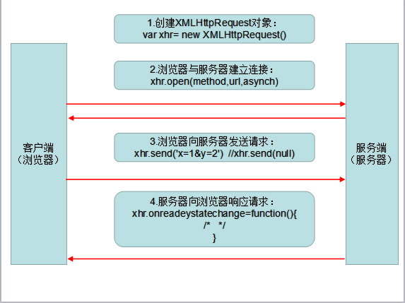

# 九.ajax 详解

### 客户端向服务端发送 ajax 请求的简单过程



### 1.创建 XMLHttpRequest 对象

- 非 ie 内核

```js
var xhr = new XMLHttpRequest()
```

- ie 内核早期 ie 版本写法

```js
var xhr = new Microsoft.XMLHTTP()
```

### 2.浏览器与服务器建立连接

- open 方法：type：请求类型 get post put delete
  url:请求地址
  async:同步为 false,异步为 true

```js
xhr.open(type, url, async)
```

### 3.浏览器向服务器发送请求

- send 方法：get 请求 send(null)

```js
xhr.send("x=1&y=2")
```

### 4.服务器向浏览器响应请求

- onreadystatechage:服务器向浏览器响应的回调函数

```js
xhr.onreadystatechange=function(){
    <!-- 代码 -->
}
```

- readyState:表示 ajax 请求的当前状态：
  0：代表未初始化，还没有调用 open 方法
  1：代表正在加载，open 方法已被调用，但 send 方法还没有被调用
  2：代表已加载完毕。send 已被调用，请求已经开始
  3：代表交互中，服务器正在发送响应
  4：代表完成，响应发送完毕

```js
xhr.onreadystatechange=function(){
    if(xhr.readyState === 4){
        <!-- 浏览器响应完毕后该做的事 -->
    }
}
```

- abort:取消 ajax 请求

```js
xhr.onreadystatechange = function() {
  if (xhr.readyState === 3) {
    xhr.abort()
  }
}
```

- status：表示服务端目前的状态
  404 没有找到页面（not found）
  403 禁止访问（forbidden）
  500 内部服务器出错（internal service error）
  200 一切正常（ok）
  304 没有被修改（not modified）(服务器返回 304 状态，表示源文件没有被修改)

```js
xhr.onreadystatechange=function(){
    if(xhr.readyState === 4){
        if(xhr.status === 200){
            <!-- 服务器正常浏览器响应完毕 -->
        }
    }
}
```
