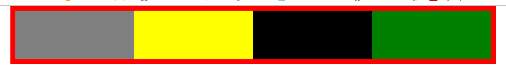

# 一.清除浮动

- 浮动：父级出现塌陷

  

- 清除浮动：

  

## 1.table

### html

```
<ul>
    <li></li>
    <li></li>
    <li></li>
    <li></li>
</ul>
```

### css

```
ul{display:table}
```

[查看代码](`./table.html`)

## 1.table

### html

```
<ul>
    <li></li>
    <li></li>
    <li></li>
    <li></li>
</ul>
```

### css

```
ul{display:table}
```

[查看代码](`./table.html`)

## 2.inline-block

### html

```
<ul>
    <li></li>
    <li></li>
    <li></li>
    <li></li>
</ul>
```

### css

```
ul{display:inline-block}
```

[查看代码](`./inline-block.html`)

## 3.父级浮动

### html

```
<ul>
    <li></li>
    <li></li>
    <li></li>
    <li></li>
</ul>
```

### css

```
ul{float:left}
```

[查看代码](`./父级浮动.html`)

## 4.overflow:hidden/auto

### html

```
<ul>
    <li></li>
    <li></li>
    <li></li>
    <li></li>
</ul>
```

### css

```
ul{overflow:hidden}
```

或者

```
ul{overflow:auto}
```

[查看代码](`./overflow.html`)

## 5.clear:both

### html

```
<ul>
    <li></li>
    <li></li>
    <li></li>
    <li></li>
</ul>
```

### css

```
 ul::after {
    content: '';
    clear: both;
    display: block;
}
```

[查看代码](`./clear.html`)
