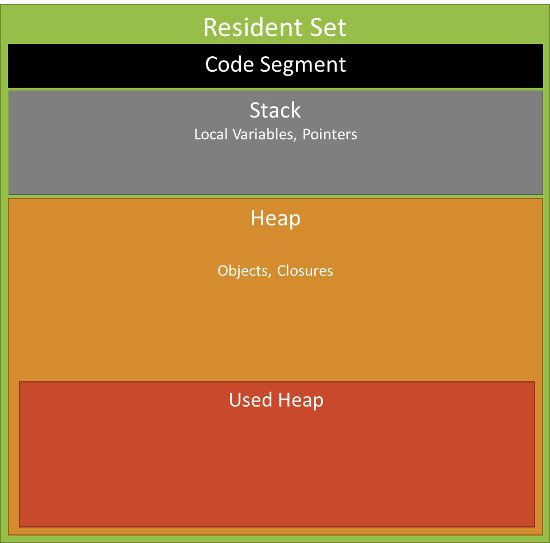
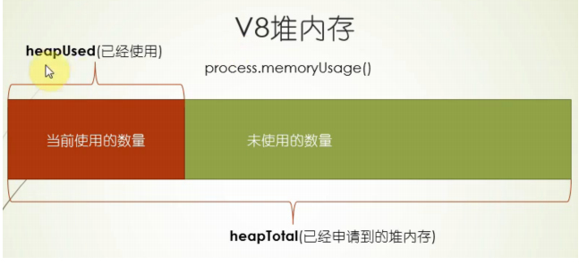

# 二十六.内存管理

## 1.javascript 中的垃圾收集

- 程序的运行需要内存，只要程序要求，操作系统就必须提供内存
- javascript 使用自动内存管理，这被称为"垃圾回收机制"
- 优点是可以简化开发、节省代码
- 缺点是无法完整的掌握内存的分配与回收的具体过程

## 1.1NodeJS 中的内存管理

- 网页端的内存泄漏
- 对于持续运行的服务进程 Node 服务器端程序，必须及时释放不再用到的内存。否则，内存占用越来越高，轻则影响系统性能，重则导致进程崩溃。
- 如果不再用到内存没有及时释放，就叫做内存泄漏

## 1.2 v8 内存管理

### 1.2.1 v8 内存限制

- 在 64 位操作系统可以使用 1.4G 内存
- 在 32 位操作系统可以使用 0.7G 内存

### 1.2.2 v8 内存管理

- js 对象都是通过 v8 进行分配管理内存的
- process.memoryUsage 返回一个对象，包含了 Node 进程的内存占用信息



- rss(resident set size):所有内存占用，包括指令区和堆栈

* heap Tatal:"堆"占用的内存，包括用到的和没用到的
* heapUsed：用到的堆的部分。判断内存泄漏，以 headUsed 字段为准

* external:V8 引擎内部的 C++对象占用的内存
  

## 为何限制内存大小

#### 因为 V8 垃圾收集工作原理导致的，1.4G 内存完成一次垃圾收集需要 1 秒以上

#### 这个暂停时间成为 Stop The Word，在这个期间，应用性能和响应能力都会下降

## 如何打开内存限制

### 一旦初始化成功，生效后不能再修改

### -max-new-space-size,最大 new space 大小，执行 scavenge 回收，默认 16M，单位 KB

```
node --max-old-space-size=2000 app.js 单位是M
```

### -max-old-space-size，最大 old sapce 大小，执行 MarkSweep 回收，默认 1G，单位 MB

```
node --max-new-space-size=1024 app.js单位是kb
```

## V8 的垃圾回收机制

### V8 是基于分代的垃圾回收

### 不同代垃圾回收机制也不一样

### 按存货的时间分为新生代和老生代

## 分代

### 年龄小的是新生代，由 From 区域和 To 区域两个区域组成

- 在 64 位系统里，新生代内存时 32M，From 区域和 To 区域各占用 16M
- 在 32 位系统里，新生代内存时 16M，From 区域和 To 区域各占用 8M

* 年龄大的是老生代，默认情况下
  - 64 位系统下老生代内存时 1400M
  - 32 位系统下老生代内存时 700M

### 引用计数

- 语言引擎有一张引用表，保存了内存里面所有的资源的引用次数
- 如果一个值的引用次数是 0，就表示这个值不再用到了，因此可以将这块内存释放。

### 新生代垃圾回收

- 新生代区域一分为二，每个 16M，一个使用，一个空闲
- 开始垃圾回收的时候，会检查 FROM 区域中的存活对象，如果还活着，拷贝到 TO 空间，完成后释放空间。
- 完成后 FROM 和 TO 互换
- 新生代扫描的时候是一种广度优先的扫描策略
- 新生代的空间小，存活对象少
- 当一个对象经历过多次的垃圾回收依然存活的时候，生存周期比较长的对象会被移动到老生代，这个移动的过程被称为晋升或者升级

### 老生代

- mark-Sweep（标记清除）mark-compact（标记整理）
- 老生代空间大，大部分都是活着的对象，GC 耗时比较长
- 在 GC 期间无法响应，STOP-THE-WORLD
- V8 有一个优化方案，增量处理，把一个大暂停换成多个小暂停 INCREMENT-GC

### mark-sweep（标记清除）

- 标记活着的对象，随后清除在标记阶段没有标记的对象，只清理死亡对象
- 问题在于清除后会出现内存不连续的情况，这种内存碎片会对后续的内存分配产生影响
- 如果要分配一个大对象，碎片空间无法分配

### mark-compact(标记整理)

- 标记死亡后会对对象进行整理，活着的对象向左移动，移动完成后直接清理掉边界外的内存

### incrementtal marking 增量标记

- 以上三种回收是都需要暂停程序执行，收集完成后才能恢复， STOP-THE-WORLD 在新生代影响不大，但是老生带影响就非常大了。
- 增量标记就是把标记改为增量标记，把一口气的停顿拆分成了多个小步骤，做完一步程序运行一会儿，垃圾回收和应用程序运行交替进行，停顿是按可以减少到 1/6 左右，包括垃圾会后的占用时间
