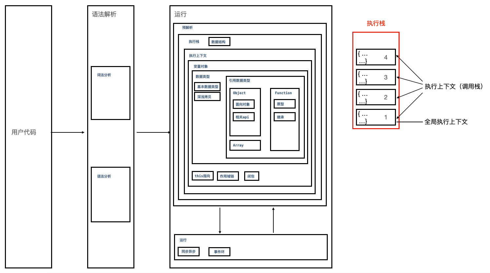

# JavaScript 运行过程
> ## 1.语法解析阶段
>
> > - #### `一.词法分析`：将 js 代码中的字符串分割为有意义的代码块，这些代码块我们可以称为“词法单元”。[案例](https://esprima.org/demo/parse.html#)
> > - #### `二.语法分析`：将词法单元流转换成一颗抽象语法树（AST）。[案例](https://esprima.org/demo/parse.html)
>
> ## 2.运行阶段
>
> > - ### 2.1 预解析：在 js 文件或 script 里面的代码在正式开始执行之前，会进行一些解析工作。
> >
> >   > - #### `三.执行上下文`：在相关[数据结构](//base/5.structure/1.index.html)(`执行栈`)中创建[执行上下文]()，里面包含相关[数据类型](//base/6.type/1.index.html)的变量
> >   >   > - #### `四.创建变量对象`
> >   >   > - #### `五.确定作用域链`：确定变量的访问规则
> >   >   > - #### `六.闭包`
> >   >   > - #### `七.确定 this 指向`
> >
> > - ### 2.2 运行：在浏览器环境中，javascript 引擎会按照 script 标签代码块从上到下的顺序加载并立即解释执行
> >   > - #### `八.同步与异步`
> >   > - #### `九.事件环`
> >   >   

一、JavaScript基础

作用域和闭包
- [ ] 1.理解词法作用域和动态作用域
- [ ] 2.理解JavaScript的作用域和作用域链
- [ ] 3.理解JavaScript的执行上下文栈，可以应用堆栈信息快速定位问题
- [x] 4.this的原理以及几种不同使用场景的取值
- [x] 5.闭包的实现原理和作用，可以列举几个开发中闭包的实际应用
- [x] 6.理解堆栈溢出和内存泄漏的原理，如何防止
- [x] 7.如何处理循环的异步操作
- [x] 8.理解模块化解决的实际问题，可列举几个模块化方案并理解其中原理
执行机制
- [ ] 1.为何try里面放return，finally还会执行，理解其内部机制
- [x] 2.JavaScript如何实现异步编程，可以详细描述EventLoop机制
- [x] 3.宏任务和微任务分别有哪些
- [ ] 4.可以快速分析一个复杂的异步嵌套逻辑，并掌握分析方法
- [ ] 5.使用Promise实现串行
- [x] 6.Node与浏览器EventLoop的差异
- [ ] 7.如何在保证页面运行流畅的情况下处理海量数据
语法和API
- [x] 1.理解ECMAScript和JavaScript的关系
- [x] 2.熟练运用es5、es6提供的语法规范，
- [x] 3.熟练掌握JavaScript提供的全局对象（例如Date、Math）、全局函数（例如decodeURI、isNaN）、全局属性（例如Infinity、undefined）
- [x] 4.熟练应用map、reduce、filter 等高阶函数解决问题
- [ ] 5.setInterval需要注意的点，使用settimeout实现setInterval
- [ ] 6.JavaScript提供的正则表达式API、可以使用正则表达式（邮箱校验、URL解析、去重等）解决常见问题
- [x] 7.JavaScript异常处理的方式，统一的异常处理方案