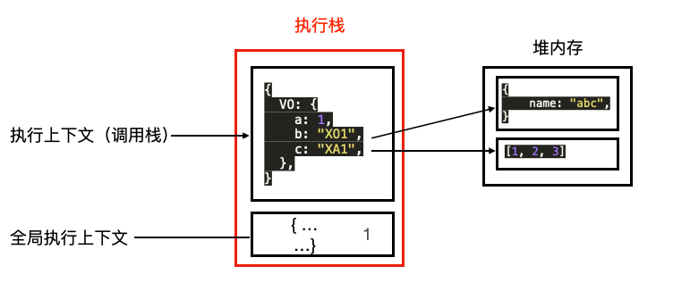

# 三.执行上下文

::: tip 执行上下文

- 当函数运行时，会创建一个执行环境，这个执行环境就叫做执行上下文
- 执行上下文中会创建一个对象叫做变量对象（Value Object），基础数据类型都保存在变量对象中
- 引用数据类型的值保存在堆里，我们通过操作对象的引用地址来操作对象

```js
function task() {
  var a = 1
  var b = {
    name: "abc",
  }
  var c = [1, 2, 3]
}
task()
```

> ```js
> let ExecuteContent = {
>   // 执行上下文中创建的变量对象
>   VO: {
>     a: 1,
>     b: "XO1",
>     c: "XA1",
>   },
> }
> ```
>
> 
> ::: warning 概括一下
> 变量对象是在执行上下文中创建的，可以看成创建对象，执行上下文创建完成后，会推入到执行栈中，可以看成数组中 push 一个对象
> :::

:::

## 1.创建变量对象

- 全局执行上下文 — 这是默认或者说基础的上下文，任何不在函数内部的代码都在全局上下文中。它会执行两件事：创建一个全局的 window 对象（浏览器的情况下），并且设置 this 的值等于这个全局对象。一个程序中只会有一个全局执行上下文。
- 函数执行上下文 — 每当一个函数被调用时, 都会为该函数创建一个新的上下文。每个函数都有它自己的执行上下文，不过是在函数被调用时创建的。函数上下文可以有任意多个。每当一个新的执行上下文被创建，它会按定义的顺序（将在后文讨论）执行一系列步骤。
- Eval 函数执行上下文 — 执行在 eval 函数内部的代码也会有它属于自己的执行上下文，但由于 JavaScript 开发者并不经常使用 eval，所以在这里我不会讨论它。

## 2.生命周期

- 一个新的执行上下文的生命周期有两个阶段
  - 创建阶段
    - 创建变量对象
    - 确定作用域链
    - 确定`this`指向
  - 执行阶段
    - 变量赋值
    - 函数赋值
    - 代码执行
