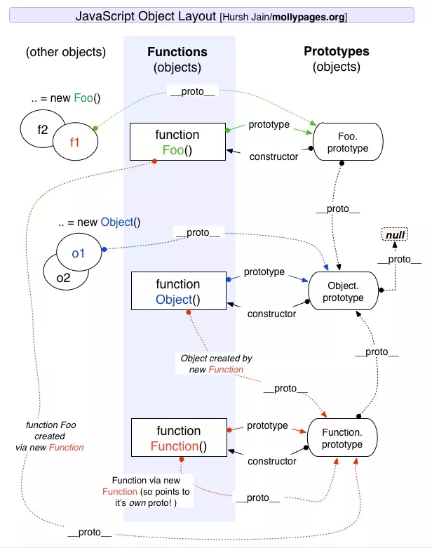

# 十一.原型和原型链
## 1.原型

每个对象初始化时会生成一个默认的属性，这个属性就是原型，当在这个对象上查找某个属性时，会先在这个对象本身查找这个属性，没有找到就会去原型上查找，原型内部有原型，没有找到依次向内部找属性，这样形成的链状结构我们称为原型链，原型链的顶层是 null

::: tip 函数原型上的一些方法

- apply: function()
- arguments: TypeError: 'arguments', 'callee', and 'caller' cannot be accessed in this context.
- bind: function()
- call: function()
- caller: TypeError: 'arguments', 'callee', and 'caller' cannot be accessed in this context.
- constructor: function()
- length: 0
- name: ""
- toString: function()
- Symbol(Symbol.hasInstance): function()

:::


- 1.对象

对象 Object 即是对象也是函数，访问函数的原型(prototype) 得到一个对象 Object.prototype,这个对象的原型(\_\_proto\_\_)可以访问到对象的根 null；访问对象的原型(\_\_proto\_\_)可以得到一个对象 Function.prototype，访问这个对象的原型(\_\_proto\_\_)可以得到 Object.prototype

实例化对象（{}）是一个对象,他的原型(\_\_proto\_\_)指向 Object 函数的 prototype，即 Object.prototype

- 2.函数

函数 Function 即是一个对象也是一个函数，访问函数原型(prototype)得到一个对象 Function.prototype，这个对象的原型(\_\_proto\_\_)指向 Object.prototype;Function 对象的原型(\_\_proto\_\_)指向 Function.prototype

- 3.自定义函数

函数 Function 即是一个对象也是一个函数，访问函数原型(prototype)得到一个对象 Function.prototype，这个对象的原型(\_\_proto\_\_)指向 Object.prototype;Function 对象的原型(\_\_proto\_\_)指向 Function.prototype

### 1.1 apply

- 模拟 apply

```js
Function.prototype.apply = function(context, args) {
  context = context ? Object(context) : window
  context.fn = this
  if (!args) {
    return context.fn()
  }
  //利用数组的toString的特性（字符串和数组拼接）
  let r = eval("context.fn(" + args + ")")
  delete context.fn
  return r
}
```

```js
fn1.apply("hello", [1, 2, 3, 4])
```

### 1.2 arguments
函数中参数的传递方式

首先看一道题目

```js
function test(person) {
  person.age = 26;
  person = {
    name: "yyy",
    age: 30
  };

  return person;
}
const p1 = {
  name: "yck",
  age: 25
};
const p2 = test(p1);
console.log(p1); // -> ?
console.log(p2); // -> ?
```

#### 对于以上的结果你知道吗？

- 首先，函数传参是传递对象指针的副本
- 然后 p1 的值被修改了
- 但是当我们重新为 person 分配了一个对象时就出现了分歧
  
- 这是 person 指针会指向重新赋值的值，所以可以知道 js 中函数赋值操作是共享赋值
### 1.3 bind

- bind 实现原理

- 1.bind 方法可以绑定 this 指向 绑定参数
- 2.bind 方法返回一个绑定后的函数（高阶函数）
- 3.如果绑定的函数被 new 了 当前函数的 this 就是当前的实例
- 4.new 出来的结果可以找到原有类的原型

```js
Function.prototype.bind = function(context) {
  let that = this
  let bindArgs = Array.prototype.slice.call(arguments, 1)
  function Fn() {}
  function fBound() {
    let args = Array.prototype.slice.call(arguments)
    return that.apply(this instanceof fBound ? this : context, bindArgs)
  }
  Fn.prototype = this.prototype
  fBound.prototype = new Fn()
  return fBound
}
fn.prototype.flag = "动物类"
let bindFn = fn.bind(obj, "猫")
let instance = new bindFn(9)
```

### 1.4 call

- 模拟 call

call 的特点：

- 可以改变我们当前函数的 this 指向
- 会让当前函数执行

```js
Function.prototype.call = function(context) {
  context = context ? Object(context) : window
  context.fn = this
  let args = []
  for (let i = 1; i < arguments.length; i++) {
    args.push("arguments[" + i + "]")
  }
  //利用数组的toString的特性（字符串和数组拼接）
  let r = eval("context.fn(" + args + ")")
  delete context.fn
  return r
}
```

调用

```js
fn1.call(fn2)
```

多个 call

```js
//多个call会指向window
fn1.call.call.call(fn2)
```

### 1.5 caller

### 1.6 constructor

### 1.7 length

### 1.8 name

### 1.9 toString

### 1.10 Symbol

## 2.原型链
