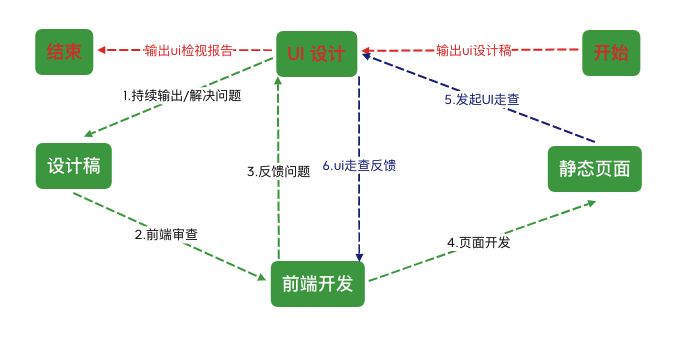
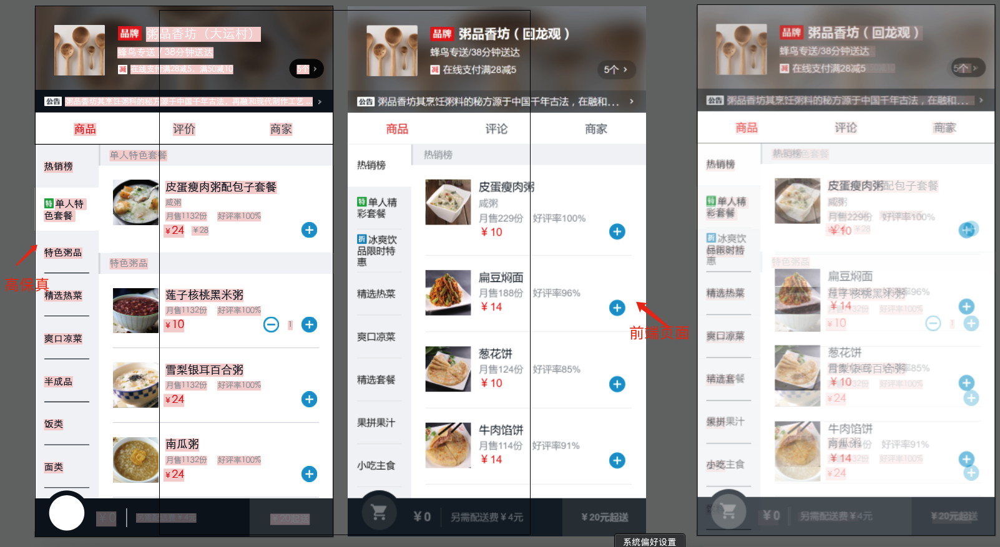

# 一.前端与 UI 工作流程

## 1.前端与 UI 开发流程

## 2.ui 走查过程

ui 走查目的是确保做出来的页面符合 ui 规范高质量保证上线质量，通过前端发起规范，避免前端页面没做好就给 ui 走查，增加 ui 工作量；通过 ui 以文档形式反馈页面的问题，避免前端不知道问题所在

打开 AI 软件，将设计稿和做好的静态页面放在一起，调节透明度，重叠在一起，如果完全重合说明前端页面高度还原设计稿，可以发送邮件给 ui 发起 ui 走查流程

