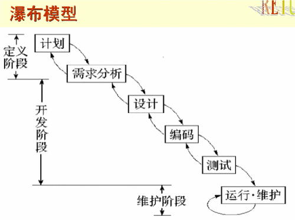
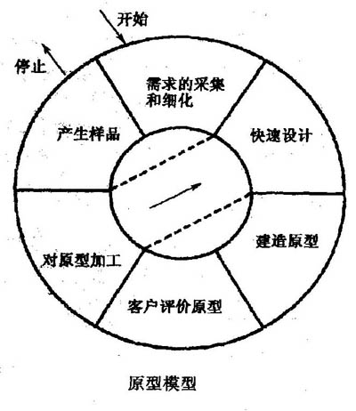

# 二.UML

## 1.软件生命周期

### 1.1 可行性分析报告和软件开发计划

- 产出可行性分析报告

### 1.2 需求分析阶段

- 由软件分析师来做，需要懂技术也需要懂业务
- 分析出软件需要完成什么功能
- 产出需求分析说明书和初步的用户手册

### 1.3 软件设计（概要设计和详细设计）

- 由架构师/项目经理来做
- 根据团队技术基础确定用什么技术栈（Java/Node/PhP）
- 确定部署的操作系统
- 使用什么数据库（oracle/mysql/sqlserver）
- 设计数据库表
- 选择团队成员
- 产出软件设计文档

### 1.4 编码工作

- 开发人员来做
- 把设计编成代码
- 产出源代码以及清单

### 1.5 测试阶段

- 由测试工程师进行
- 分为白盒测试（单元测试）和黑盒测试（功能测试）
- 产出软件测试报告

### 1.6 实施和维护工作

- 由实施工程师执行
- 把项目按照需求安装和配置好，让客户使用并解决简单问题
- 产出软件维护报告

## 2.软件开发模型

### 2.1 瀑布模型

- 瀑布模型（Waterfall Model）是一个项目开发架构
- 开发过程是通过设计一系列阶段顺序展开的，从系统需求分析开始直到产品发布和维护，每个阶段都会产生循环反馈
- 如果有信息未被覆盖或者发现了问题，那么最好“返回”上一个阶段并进行适当的修改，项目开发进程从一个阶段“流动”到下一个阶段，这也是瀑布模型名称的由来

### 2.2 增量开发模型

- 增量模型是把待开发的软件系统模块化，将每个模块作为一个增量组件，从而分批次地分析、设计、编码和测试这些增量组件

### 2.3 原型开发模型

原型模型指的是在执行实际软件的开发之前，应当建立系统的一个工作原型

## 3.模型

- 建造一栋大楼前需要先把图纸将外观、内部结构描述清楚，这些图纸就是模型
- Unified Modeling Language（UML）又称统一建模语言或标准建模语言

### 3.1 模型的三个特点

- 简化
- 多视角
- 通用符号

### 3.2 开发软件

rational rose

### 3.3 UML 组成

## 4.模型图

### 4.1 用例图

- 用例建模最主要的功能是表达系统的功能性需求或行为
- 参与者：参与者指的是与系统交互的角色，可以是人，也可以是事物或其它系统
- 用例时系统为参与者提供的功能。用例名称一般是一个带有动作性的词语

### 4.2 类图和对象图

### 4.3 类图的关系

#### 4.3.1 依赖关系

#### 4.3.2 泛化关系

#### 4.3.3 实现关系

#### 4.3.4 关联关系

#### 4.3.5 聚合关系

#### 4.3.6 组合关系

### 4.4 活动图

### 4.5 时序图

### 4.6 协作图

### 4.7 组件图

### 4.8 部署图
