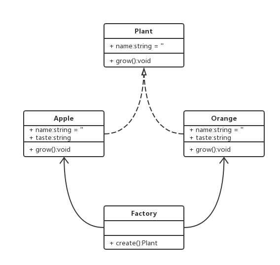
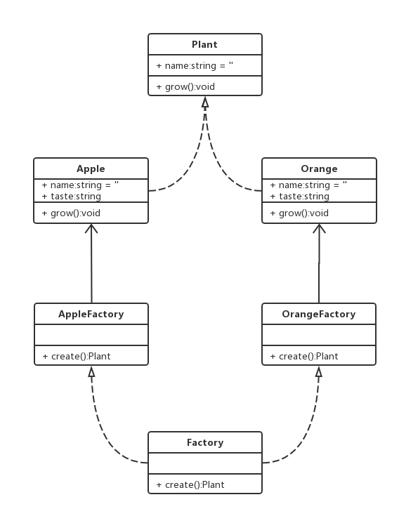

# 一.工厂模式

## 1.简单工厂模式

- 简单工厂模式是由一个工厂对象决定创建出哪一种产品类的实例

### 1.1 类图



### 1.2 代码

```ts
//简单的工厂模式案例
class Plant {
  name: string
  constructor(name: string) {
    this.name = name
  }
  growing(): void {
    console.log("生长")
  }
}
class Apple extends Plant {
  taste: string
  constructor(name: string, taste: string) {
    super(name)
    this.taste = taste
  }
}
class Orange extends Plant {
  taste: string
  constructor(name: string, taste: string) {
    super(name)
    this.taste = taste
  }
}
class Factory {
  static create(name: string) {
    switch (name) {
      case "apple":
        return new Apple("苹果", "甜的")
      case "orange":
        return new Orange("橘子", "酸的")
    }
  }
}
let apple1 = Factory.create("apple")
console.log(apple1)
let orange1 = Factory.create("orange")
console.log(orange1)
```

### 1.3 场景

- jQuery：每次调用 jq 自己都会在内部 new 一个新的实例

```ts
class jQuery {
  length: number
  constructor(selector: string) {
    let elements = (<any>Array).from(document.querySelectorAll(selector))
    let length = elements ? elements.length : 0
    for (let i = 0; i < length; i++) {
      this[i] = elements[i]
    }
    this.length = length
  }
  html() {}
}
let $ = function (selector: string) {
  return new jQuery(selector)
}
```

- React

```ts
class Vnode {
  tag: string
  attrs: string
  children: string
  constructor(tag: string, attrs: string, children: string) {
    this.tag = tag
    this.attrs = attrs
    this.children = children
  }
}
let React: any = { createElement: "" }
React.createElement = function (
  tag: string,
  attrs: string,
  children: string
): object {
  return new Vnode(tag, attrs, children)
}
```

## 2.工厂方法模式

- 工厂方法模式`Factory Method`,又称多态性工厂模式
- 在工厂方法模式中，核心的工厂类不再负责所有的产品的创建，而是将具体创建的工作交给子类去做

### 2.1 类图



### 2.2 代码

```ts
class Plant {
  name: string
  constructor(name: string) {
    this.name = name
  }
  grow() {
    console.log("grow~~~")
  }
}
class Apple extends Plant {
  taste: string
  constructor(name: string) {
    super(name)
    this.taste = "甜"
  }
}
class Orange extends Plant {
  taste: string
  constructor(name: string) {
    super(name)
    this.taste = "酸"
  }
}
class AppleFactory {
  create() {
    return new Apple("苹果")
  }
}
class OrangeFactory {
  create() {
    return new Orange("橘子")
  }
}
const settings = {
  apple: AppleFactory,
  orange: OrangeFactory,
}
let apple = new settings["apple"]().create()
console.log(Apple)
let orange = new settings["orange"]().create()
console.log(Orange)
```

## 3.抽象工厂模式

- 抽象工厂模式是指当有多个抽象角色时，使用的一种工厂模式
- 抽象工厂模式可以向客户端提供一个接口，使客户端在不必指定产品的具体情况下，创建多个产品族中的产品对象

### 3.1 类图


```ts
class Button {
  render(button) {
    console.log(button)
  }
}
class AppleButton extends Button {}
class WindowsButton extends Button {}
class Icon {
  render(icon) {
    console.log(icon)
  }
}
class AppleIcon extends Icon {}
class WindowsIcon extends Icon {}
class AppleFactory {
  createButton() {
    return new AppleButton("苹果按钮")
  }
  createIcon() {
    return new AppleIcon('苹果图标')
  }
}
class WindowsFactory {
  createButton() {
    return new WindowsButton('Windows按钮')
  }
  createIcon() {
    return new WindowsIcon('Windows图标')
  }
}
const settings = {
  apple: AppleFactory,
  windows: WindowsFactory,
}
let appleFactory = new settings["apple"]()
appleFactory.createButton().render()
appleFactory.createIcon().render()

let windowsFactory = new settings["windows"]()
windowsFactory.createButton().render()
windowsFactory.createIcon().render()
```

```ts
var jsPerson = {
  name: "223",
  age: "34",
  writeJs: function () {
    console.log("my name is " + this.name)
  },
}
jsPerson.writeJs()

//单例模式虽然解决了分组的作用，但是不能实现批量的生产，属于手工作用模式 -->"工厂模式"
//把实现同一事件的相同代码放到一个函数中，以后如果在想实现这个功能，不需要从新编写这些代码，只需要执行当前的函数即可 -->'函数的封装'
//-->'低耦合高内聚'：减少页面中的冗余代码，提高代码的重复利用率
function createJsPerson(name, age) {
  var obj = {}
  obj.name = name
  obj.age = age

  obj.writeJs = function () {
    console.log("my name is " + this.name)
  }
  return obj
}
var p1 = createJsPerson("xxx", "47")

//所有的编程语言都是面向对象开发的 -->类的继承、封装、多态
//继承：子类继承父类中的属性和方法
//多态：当前方法的多种形态（后台语言中：多态包含重载和重写）

//js中不存在重载，方法名一样的话，后面的会把前面的覆盖掉，最后只保留一个
//js中有一个操作类似重载但是不是重载：我们可以根据传递参数的不一样的，实现不同的功能
function sum(num) {
  if (typeof num === "undefined") {
    return 0
  }
  return num
}
sum(100)
sum()

//重写：子类重写父类的方法
```
