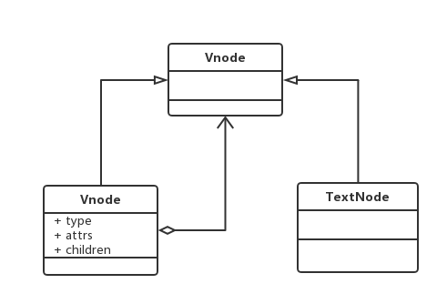

# 十一.组合模式

- 又称整体-部分模式
- 将对象组合成树形结构以表示部分-整体的层次结构
- 客户可以使用统一的方式对待组合对象和叶子对象

## 1.类图



## 2.代码

```html
<!DOCTYPE html>
<html lang="en">
  <head>
    <meta charset="UTF-8" />
    <meta name="viewport" content="width=device-width, initial-scale=1.0" />
    <meta http-equiv="X-UA-Compatible" content="ie=edge" />
    <title>组合模式</title>
  </head>

  <body>
    <div id="root"></div>
    <script>
      // ReactDOM.render(<span><span>hello</span>world</span>, document.querySelector("#root"))
      class ReactElement {
        constructor(type, props) {
          this.type = type
          this.props = props
        }
      }
      function createElement(type, props = {}, ...children) {
        return new ReactElement(type, {
          ...props,
          children: children.length == 1 ? children[0] : children,
        })
      }
      let rootElement = createElement(
        "span",
        null,
        "hello",
        createElement("span", null, "world")
      )
      function render(element, container) {
        let { type, props } = element
        let domElement = document.createElement(type)
        for (let attr in props) {
          if (attr === "children") {
            if (typeof props[attr] == "object") {
              props[attr].forEach((item) => {
                if (typeof item == "object") {
                  render(item, domElement)
                } else {
                  domElement.appendChild(document.createTextNode(item))
                }
              })
            } else {
              domElement.appendChild(document.createTextNode(props[attr]))
            }
          } else if (attr === "className") {
            domElement.setAttribute("class", props[attr])
          } else {
            domElement.setAttribute(attr, props[attr])
          }
        }
        container.appendChild(domElement)
      }
      render(rootElement, document.querySelector("#root"))
    </script>
  </body>
</html>
```

## 3.应用场景

### 3.1 文件夹和文件

```js
function Folder(name) {
  this.name = name
  this.children = []
  this.parent = null
}
Folder.prototype.add = function(child) {
  child.parnet = this
  this.children.push(child)
}
Folder.prototype.show = function() {
  console.log("文件夹" + this.name)
  for (let i = 0; i < this.children.length; i++) {
    this.children[i].show()
  }
}
function File(name) {
  this.name = name
}
File.prototype.add = function() {
  throw new error("文件夹不能")
}
File.prototype.show = function() {
  console.log("文件" + this.name)
}
let video = new Folder("video")
let vue = new Folder("vue")
let react = new Folder("react")
let vuejs = new File("vuejs")
let reactjs = new File("reactjs")
```

### 3.2 绘制表单

```js
class FormContainer {
  constructor(type) {
    this.element = document.createElement(type)
    this.children = []
  }
  add(child) {
    this.children.push(child)
    this.element.appendChild(child.element)
    return this
  }
}
class FieldContainer {
  constructor(type) {
    this.element = document.createElement(type)
    this.children = []
  }
  add(child) {
    this.children.push(child)
    this.element.appendChild(child.element)
    return this
  }
}
class LabelItem {
  constructor(title) {
    this.element = document.createElement("label")
    this.element.innerHTML = title
  }
}
class InputItem {
  constructor(title) {
    this.element = document.createElement("input")
    this.element.name = title
  }
}
class TipItem {
  constructor(title) {
    this.element = document.createElement("span")
    this.element.innerHTML = title
  }
}
let userform = new FormContainer("form")
  .add(
    new FieldContainer("p")
      .add(new LabelItem("用户名"))
      .add(new InputItem("username"))
      .add(new TipItem("用户名长度为6-8位"))
  )
  .add(
    new FieldContainer("p")
      .add(new LabelItem("密码"))
      .add(new InputItem("password"))
      .add(new TipItem("确认密码"))
  )
document.body.appendChild(userform.element)
```
