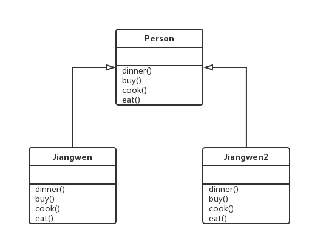

# 十四.模版方法模式

- 模版方法模式在一个方法中定义一个算法的骨架，而将一些步骤的实现延迟到子类中
- 模版方法使得子类可以在不改变算法结构的情况下，重新定义算法中某些步骤的具体实现
- 一般有两部分组成，第一部分是抽象父类，第二部分是具体的实现子类
- 好莱坞原则，子类放弃了控制权，改由父类来调用
  - 发布订阅
  - 回调函数

## 1.类图



## 2.代码

```js
class Person {
  dinner(){
    this.buy()
    this.cook()
    this.eat()
  }
  buy()
  cook()
  eat()
}
class Xiaomin extends Person {
  buy(){
    console.log('买黄瓜')
  }
  cook(){
    console.log('拍黄瓜')
  }
  eat(){
    console.log('吃黄瓜')
  }
}
let x = new Xiaomin()
x.dinner()
```

## 3.场景

### 3.1 提示框

```html
<!DOCTYPE html>
<html lang="en">
  <head>
    <meta charset="UTF-8" />
    <meta name="viewport" content="width=device-width, initial-scale=1.0" />
    <meta http-equiv="X-UA-Compatible" content="ie=edge" />
    <title>Document</title>
    <link rel="stylesheet" href="3.css" />
  </head>
  <body>
    <script src="3.js"></script>
    <script>
      let dialog = new ConfirmDialog({
        title: "标题",
        content: "内容",
      });
    </script>
  </body>
</html>
```

```js
class Dialog{
    constructor(options) {
        this.title = options.title||'标题';
        this.content = options.content||'内容';
        this.onConfirm = options.onConfirm||this.hide;
        this.onCancel = options.onCancel||this.hide;
        this.init();
        this.initEventHandler();
    }
    init() {
        this.panel=document.createElement('div');
        this.panel.className='dialog';

        this.titleP=document.createElement('p');
        this.titleP.innerHTML=this.title;
        this.panel.appendChild(this.titleP);

        this.contentP=document.createElement('p');
        this.contentP.innerHTML=this.content;
        this.panel.appendChild(this.contentP);

        this.confirmBtn=document.createElement('button');
        this.confirmBtn.className='button confirm-button';
        this.confirmBtn.innerHTML='确定';
        this.panel.appendChild(this.confirmBtn);

        this.cancelBtn=document.createElement('button');
        this.cancelBtn.className='button cancel-button';
        this.cancelBtn.innerHTML='取消';
        this.panel.appendChild(this.cancelBtn);

        document.body.appendChild(this.panel);
    }
    inithttp://image.bubuko.com/info/201807/20180712173511381297.pngntListener('click',() => {
            this.onConfirm();
            this.hide();
        });
        this.cancelBtn.addEventListener('click',() => {
            this.onCancel();
            this.hide();
        });
    }
    show() {
        this.panel.style.display='block';
    }
    hide() {
        this.panel.style.display='none';
    }
}

class ContentDialog extends Dialog{
    init() {
        super.init();
        this.titleP.parentNode.removeChild(this.titleP);
    }
}

class ConfirmDialog extends Dialog{
    init() {
        super.init();
        this.cancelBtn.parentNode.removeChild(this.cancelBtn);
    }
}
```
```css
.dialog{
    width:400px;
    height:300px;
    position: absolute;
    padding:20px;
    top:50%;
    left:50%;
    margin-left:-200px;
    margin-top:-150px;
    border:1px solid#000;
    background-color: #EEE;
    border-radius: 5px;
    display: flex;
    flex-direction: column;
    align-items: center;
    justify-content: center;
}

.dialog button{
    width:100px;
    height:30px;
    position: absolute;
    border: none;
    outline: none;

}
.dialog .confirm-button {
    right:140px;
    bottom:20px;
}
.dialog .cancel-button {
    right:20px;
    bottom:20px;
}
```

