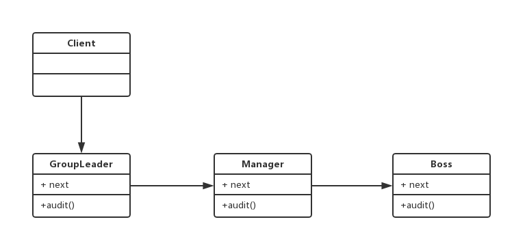

# 十七.职责链模式

- 一步操作可以分为多个职责角色来完成
- 把这些角色都分开，然后用一个链串起来
- 将发起者和各个处理者进行隔离

## 类图



## 代码

```js
class Employee {
  constructor(next) {
    this.next = next;
  }
}
class GroupLeader extends Employee {
  audit() {
    console.log("组长已经审批");
    this.next && this.next.audit();
  }
}
class Manager extends Employee {
  audit() {
    console.log("经理已经审批");
    this.next && this.next.audit();
  }
}
class Boss extends Employee {
  audit() {
    console.log("老板已经审批");
    this.next && this.next.audit();
  }
}
let boss = new Boss();
let manager = new Manager(boss);
let groupLeader = new GroupLeader(manager);
groupLeader.audit();
```
