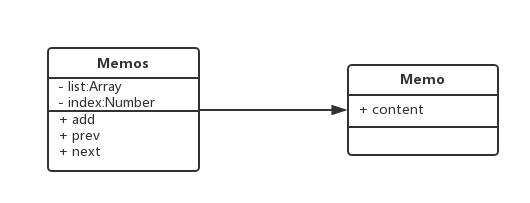

# 十九.备忘录模式

- 记录一个对象的变化
- 可以恢复之前的某个状态

## 类图



## 代码

```jsx
<input type="text" id="content">
<button id="save-btn">保存</button>
<button id="prev-btn">上一步</button>
<button id="next-btn">下一步</button>
<script>
  let content = document.getElementById('content');
  let saveBtn = document.getElementById('save-btn');
  let prevBtn = document.getElementById('prev-btn');
  let nextBtn = document.getElementById('next-btn');
  class Memo{
      constructor(content){
          this.content = content;
      }
  }
  class Memos {
      constructor(){
          this.index = 0;
          this.list = [new Memo('')];
      }
      add(content){
          this.list[++this.index] = new Memo(content);
      }
      get(){
          return this.list[this.index];
      }
      prev(){
          if(this.index ==0) return alert('没有上一步');
          return this.list[--this.index];
      }
      next(){
            if(this.index ==this.list.length-1) return alert('没有下一步');
          return this.list[++this.index];
      }
  }
  let memos = new Memos();
  saveBtn.addEventListener('click',function(){
      memos.add(content.value);
  });
  prevBtn.addEventListener('click',function(){
      let memo = memos.prev();
      content.value = memo.content;
  });
  nextBtn.addEventListener('click',function(){
      let memo = memos.next();
      content.value = memo.content;
  });
</script>
```
