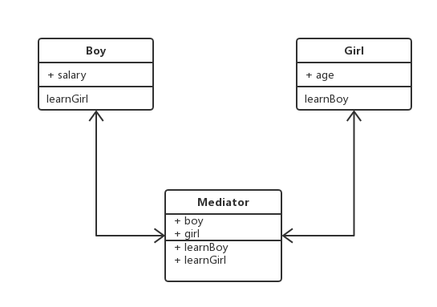

# 二十二.中介者模式

## 1.类图



## 2.代码

```js
class Boy {
  constructor(mediator) {
    this.mediator = mediator;
    this.salary = 1000;
  }
  learnGirl() {
    this.mediator.learnGirl();
  }
}
class Girl {
  constructor(mediator) {
    this.mediator = mediator;
    this.age = 28;
  }
  learnBoy() {
    this.mediator.learnBoy();
  }
}
class Mediator {
  constructor(boy, girl) {
    this.boy = boy;
    this.girl = girl;
  }
  learnBoy() {
    console.log(`这个男孩月薪${this.boy.salary * 10}`);
  }
  learnGirl() {
    console.log(`这个女孩年龄${this.girl.age - 10}`);
  }
}
let boy = new Boy();
let girl = new Girl();
let mediator = new Mediator(boy, girl);
boy.mediator = mediator;
girl.mediator = mediator;
boy.learnGirl();
girl.learnBoy();
```
