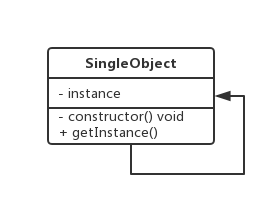

# 三.单例模式

## 1.类图



## 2.代码

```ts
//基本数据类型String Number Undefineds
//引用数据类型Object Function

//对象数据类型的作用
//把描述同一事物（同一个对象）的属性和方法在一个内存空间下，起到了分组的作用，这样不同事物之间的属性即使属性名相同，相互也不会发生冲突
//我们把这种分组编写代码的模式叫做""单例模式"
//在单利模式中我们把preson1或者preson2也叫做“命名空间”
var person = {
  name: "yiyi",
  age: "17",
}
var person = {
  name: "wew",
  age: "16",
}

//单利模式是一种项目开发中经常使用的模式，因为项目中我们可以使用单利模式来进行“模块化开发”
//“模块化开发”对于一个相对来说比较大的项目，需要多人协作的开发，我们一般情况下会根据当前项目的需求划分成几个功能板块，每个人负责一部分，同事开发，最后把每个人的代码进行合并
//公共模块
var utils = {
  select: function () {},
}
//页卡模块中的change-->实现选项卡切换
var tabRender = {
  change: function () {
    utils.select() //在自己的命名空间下调用其他命名空间的方法
  },
}
//搜索模块change ->搜索内容变化处理
var searchRender = {
  change: function () {
    this.clickEven() //在自己的命名空间下调用自己的方法
  },
  clickEven: function () {},
}

/* 惰性思想封装 */
//使用惰性思想（js高级编程）
```

### 2.1 typescript 单例模式

```ts
class Window {
  name: string
  constructor(name: string) {
    this.name = name
  }
  static getInstance(name: string) {
    var ins: any = this.instance || null
    if (!ins) {
      ins = new Window(name)
    }
    return this.getInstance
  }
}
var w1 = Window.getInstance()
var w2 = Window.getInstance()
console.log(w1 === w2)
```

### 2.2 es5 单例模式

```js
var Window = function (name) {
  this.name = name
}

Window.prototype.getName = function () {
  console.log(this.name)
}
Window.getInstance = (function () {
  var window = null
  return function (name) {
    if (!window) window = new Window(name)
    return window
  }
})()
var window = Window.getInstance("123")
window.getName()
```

### 2.3 透明单例

```ts
let Window = (function () {
  let window
  let Window = function (name) {
    if (window) {
      return window
    } else {
      this.name = name
      return (window = this)
    }
  }
  Window.prototype.getName = function () {
    console.log(this.name)
  }
  return Window
})()
let window1 = new Window("123")
let window2 = new Window("123")
window1.getName()
console.log(window1 === window2)
```

### 2.4 单例与构建分离

```js
function Window(name) {
  this.name = name
}
Window.prototype.getName = function () {
  console.log(this.name)
}
let createSingle = (function () {
  let instance
  return function (name) {
    if (!instance) {
      instance = new Window(name)
    }
    return instance
  }
})()
let window1 = new createSingle("123")
let window2 = new createSingle("123")
window1.getName()
console.log(window1 === window2)
```

### 2.5 封装变量

```js
function Window(name) {
  this.name = name
}
Window.prototype.getName = function () {
  console.log(this.name)
}
let createSingle = function (Constructor) {
  let instance
  return function () {
    if (!instance) {
      Constructor.apply(this, arguments)
      Object.setPrototypeOf(this.Constructor.prototype)
      instance = this
    }
    return instance
  }
}
let CreateSingle = createSingle(Window)
let window1 = new CreateSingle("123")
let window2 = new CreateSingle("123")
window1 = window2
console.log(window1 === window2)
```

### 2.6 命名空间

- 用户编写的代码与内部的类/函数/常量或第三方类/函数/常量之间的名字冲突
- 为很长的标识符名称创建一个别名（或简短）的名称，提高源代码的可读性。

jQuery

```js
let $ = {
  ajax() {},
  get() {},
  post() {},
}
```

```js
let utils = {}
utils.def = function (namespace, fn) {
  let _namespace = namespace.split(".")
  let fnName = _namespace.pop()
  let current = utils
  for (let i = 0; i < _namespace.length; i++) {
    let __namespace = _namespace[i]
    if (!current[__namespace]) {
      current[__namespace] = {}
    }
    current[__namespace][fnName] = fn
  }
}
utils.def("dom.attr", function (key) {
  console.log("dom.attr")
})
utils.def("dom.html", function (html) {
  console.log("dom.html")
})
utils.def("string.trim", function () {
  console.log("string.trim")
})
utils.dom.attr("src")
utils.string.trim("aa")
console.dir(utils)
```

## 3.场景

### 3.1 jQuery

```js
if (window.jQuery != null) {
  return window.jQuery
} else {
  // init
}
```

### 3.2 模态窗口

### 3.3 store

### 3.4 缓存

### 3.5 LRU 缓存

- lru-cache
- 为 LRU Cache 设计一个数据结构，它支持两个操作：
  - 1.get(key):如果 key 在 cache 中，则返回对应的 value 值，否则返回-1
  - set(key,value):如果 key 不在 cache 中，则将该(key,value)插入 cache 中（注意，如果 cache 已满，则必须把最近最久未使用的元素从 cache 中删除）；如果 key 在 cache 中，则重置 value 的值
