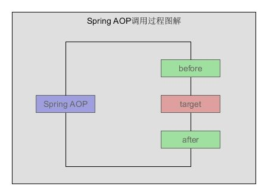

# 七.装饰器模式

- 在不改变其原有的结构和功能为对象添加新功能
- 装饰比继承更加灵活

## 1.类图


## 2.代码

```js
class Duck {
  eat(food) {
    console.log(`吃${food}`)
  }
}
class TangDuck {
  constructor() {
    this.duck = new Duck()
  }
  eat() {
    this.duck.eat("鸡肉")
    console.log("谢谢")
  }
}
```

## 3.包装器

装饰器模式是将一个对象嵌入另一个对象之中，实际上相当于这个对象被另一个对象包装起来，形成一条包装链。请求随着这条链条依次传递到所有的对象，每个对象有处理这个请求的机会

```js
class Coffee {
  make(water) {
    return `${water}+咖啡`
  }
  cost() {
    return 10
  }
}
class MilkCoffee {
  constructor(parent) {
    this.parent = parent
  }
  make(water) {
    return `${this.parent.make(water)}+牛奶`
  }
  cost() {
    return this.parent.cost() + 1
  }
}
class SuggerCoffee {
  constructor(parent) {
    this.parent = parent
  }
  make(water) {
    return `${this.parent.make(water)}+糖`
  }
  cost() {
    return this.parent.cost() + 1
  }
}
let coffee = new Coffee()
let milkCoffee = new MilkCoffee(coffee)
let milkSugerCoffee = new SuggerCoffee(milkCoffee)
console.log(milkSugerCoffee.make("水") + "=" + milkSugerCoffee.cost())
```

## 4.AOP

- 在软件业，AOP 为 Aspect Oriented Programming 的缩写，意为：面向切面编程
- 可以通过预编译方式和运行期动态代理实现在不修改源代码的情况下给程序动态统一添加功能的一种技术



```js
Function.prototype.before = function (beforeFn) {
  let _this = this
  return function () {
    beforeFn.apply(this, arguments)
    return _this.apply(this, arguments)
  }
}
Function.prototype.after = function (afterFn) {
  let _this = this
  return function () {
    _this.apply(this, arguments)
    afterFn.apply(this, arguments)
  }
}
function buy(money, goods) {
  console.log(`花${money}买${goods}`)
}
buy = buy.before(function () {
  console.log("攒钱买东西")
})
buy = buy.after(function () {
  console.log("剩下的钱存起来")
})
buy(8000, "电脑")
```

## 5.场景

### 5.1 埋点

### 5.2 表单校验

### 5.3 防 CSRF 攻击

### 5.4 支持 decorators

### 5.5 类 decorators

### 5.6 方法 decorators
