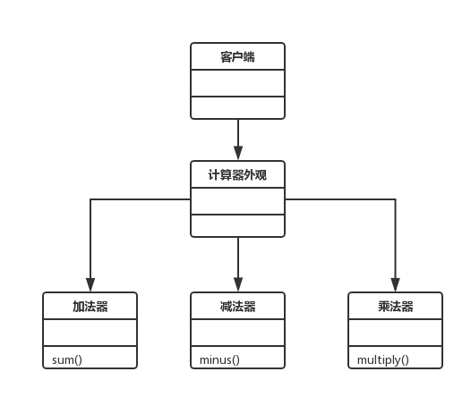

# 九.外观模式

该模式就是把一些复杂的流程封装成一个接口供给外部用户更简单的使用

- 门面角色：外观模式的核心。它被客户角色调用，它熟悉系统的功能。内部根据客户角色的需求预定了几种功能的组合
- 子系统角色：实现了子系统的功能。它对客户角色和 Facade 是未知的
- 客户角色：通过调用 Facade 来完成要实现的功能


## 1.类图



```js
class Sum {
  sum(a, b) {
    return a + b
  }
}
class Minus {
  minus(a, b) {
    return a - b
  }
}
class Multiply {
  multiply(a, b) {
    return a * b
  }
}
class Calculator {
  constructor() {
    this.sumObj = new Sum()
    this.minusObj = new Minus()
    this.multiplyObj = new Multiply()
  }
  sum(...args) {
    this.sumObj.sum(...args)
  }
  minus(...args) {
    this.minusObj.minus(...args)
  }
  multiply(...args) {
    this.multiplyObj.multiply(...args)
  }
}
let calculator = new Calculator()
calculator.sum(1, 2)
calculator.minus(1, 2)
calculator.multiply(1, 2)
```

```js
class CPU {
  start() {
    console.log("打开CPU")
  }
}
class Memory {
  start() {
    console.log("打开内存")
  }
}
class Disk {
  start() {
    console.log("打开硬盘")
  }
}
class Computer {
  constructor() {
    this.cpu = new CPU()
    this.memory = new Memory()
    this.disk = new Disk()
  }
  start() {
    this.cpu.start()
    this.memory.start()
    this.disk.start()
  }
}
new Computer().start()
```
